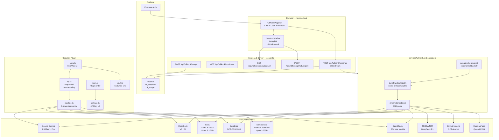

# 1. Project Reconstruction

**Project Name:** fullKONK_> — part of the KONKRED platform (konkred.xyz)

**Summary:** fullKONK_> is an AI-powered full-stack product engineering environment that accepts a plain-language product idea and returns a complete, deployable application — frontend and backend unified, integration-verified, ready to ship. It exists in two forms: a feature inside the konkred.xyz web platform (React 19 + Vite + Express 5 + Firebase), and a standalone Obsidian community plugin. Both share the same three-stage pipeline — ARCHITECT, BUILD, VERIFY — and the same multi-provider orchestration layer that routes each stage to the best available free AI model and automatically fails over when a provider rate-limits.

**Goals:**
- Replace the fragmented workflow of using ChatGPT/Copilot/v0 separately for frontend and backend
- Produce integrated, type-consistent, deploy-ready code — not snippets
- Use only free-tier AI providers so inference cost is near zero
- Work identically on web and inside Obsidian (desktop + Android)

**Non-goals:**
- Live code execution environment on the Obsidian side (no Node.js runtime in plugin)
- Replacing a full IDE
- Fine-tuning models

**Confirmed features:**
- 3-stage pipeline: Architect → Frontend + Backend → Verify
- Multi-provider orchestration with exponential-backoff failover
- 14 models across 9 providers, all free-tier
- Session history persisted in Firestore (web) / vault markdown (Obsidian)
- Usage analytics in Firestore
- GitHub export (create branch + upload files + open PR)
- Download as ZIP
- Live preview via Sandpack (web only)
- 6 showcase templates
- Settings UI with API key management

**Incomplete / inferred:**
- [INFERRED] Project memory / incremental building — designed, not implemented
- [INFERRED] Diff view on iteration — designed, not implemented
- [INFERRED] Test generation stage — designed, not implemented
- konkred.xyz homepage product cards — prompt written, not wired

**Tech stack:**

| Layer | Web (konkred.xyz) | Obsidian Plugin |
|---|---|---|
| Frontend | React 19, Vite, TypeScript strict | Obsidian ItemView API |
| Styling | Tailwind CSS, Framer Motion v12 | Inline styles |
| Backend | Express 5, TypeScript | N/A (direct API calls) |
| Database | Firebase Firestore | Vault markdown files |
| Auth | Firebase Auth | N/A (local) |
| HTTP | fetch + SSE streaming | requestUrl (Obsidian) |
| Build | Vite | esbuild |

---

# 2. Architecture



---

# 3. Repository Structure

```
fullkonk/
├── web/                          ← konkred.xyz web platform
│   ├── src/
│   │   ├── pages/
│   │   │   └── FullKonkPage.tsx
│   │   ├── components/
│   │   │   └── fullkonk/
│   │   │       ├── ChatPanel.tsx
│   │   │       ├── CodeOutput.tsx
│   │   │       ├── PipelineStatusBar.tsx
│   │   │       ├── ProviderBar.tsx
│   │   │       ├── SessionSidebar.tsx
│   │   │       ├── AnalyticsDashboard.tsx
│   │   │       ├── GitHubExportModal.tsx
│   │   │       └── LiveEnvironment.tsx
│   │   ├── services/
│   │   │   ├── fullkonk.ts
│   │   │   ├── fullkonk.orchestrator.ts
│   │   │   ├── fullkonk.sessions.ts
│   │   │   ├── fullkonk.analytics.ts
│   │   │   ├── fullkonk.github.ts
│   │   │   └── fullkonk.templates.ts
│   │   └── types.ts
│   ├── server.ts
│   ├── package.json
│   ├── tsconfig.json
│   ├── vite.config.ts
│   └── .env.example
│
├── obsidian-plugin/              ← Obsidian community plugin
│   ├── src/
│   │   ├── main.ts
│   │   ├── types.ts
│   │   ├── api.ts
│   │   ├── pipeline.ts
│   │   ├── templates.ts
│   │   ├── vault.ts
│   │   ├── settings.ts
│   │   └── view.ts
│   ├── manifest.json
│   ├── package.json
│   ├── tsconfig.json
│   ├── esbuild.config.mjs
│   └── .env.example
│
└── docs/
    ├── ARCHITECTURE.md
    ├── API.md
    ├── SETUP.md
    ├── DEPLOYMENT.md
    ├── CONFIGURATION.md
    └── DEVELOPMENT.md
```

---

# 4. Documentation

---

FILE: README.md

```markdown
# fullKONK_>

AI-powered full-stack product builder. Describe an idea in plain language.
Receive a complete, deployable application — frontend and backend unified,
integration-verified, ready to ship.

Part of the KONKRED platform at [konkred.xyz](https://konkred.xyz).

---

## What it is

fullKONK_> runs a three-stage pipeline for every build request:

1. **ARCHITECT** — one model designs the entire system before any code is written:
   component tree, API contract, database schema, auth strategy, file structure.
2. **BUILD** — two sequential passes against the same architecture plan:
   frontend (React 19 + Tailwind + Framer Motion) and backend (Express 5 + Zod + Firebase).
3. **VERIFY** — a third model reads both outputs, checks type consistency and API alignment,
   and corrects every mismatch.

A provider orchestration layer routes each stage to the highest-scoring available model
across 9 free-tier providers. If a provider returns 429, it is penalized with exponential
backoff and the next candidate takes over automatically. The user never sees a failure.

---

## Features

- Three-stage pipeline: Architect → Build → Verify
- 14 models across 9 providers — all free tier, no credit card required
- Smart routing: each task (architect, frontend, backend, verify) scored independently
- Auto-failover with exponential backoff per model
- Session history in Firestore (web) / vault markdown (Obsidian)
- Usage analytics dashboard
- GitHub export: create branch, upload all files, open PR
- Download all files as ZIP
- Live preview via Sandpack for React output (web only)
- 6 showcase templates: Prompt Autopsy, Git Archaeologist, Chaos Merchant,
  Contract Ghost, The Interrogator, Signal/Noise
- Obsidian plugin: same pipeline, works on Desktop + Android + iOS

---

## Prerequisites

**Web platform:**
- Node.js 20+
- A Firebase project (Auth + Firestore enabled)
- At least one API key from the provider list below

**Obsidian plugin:**
- Obsidian 1.4.0+
- Node.js 20+ (for building only)
- At least one API key

**Free provider API keys (get at least one):**

| Provider   | Sign-up URL                              | Free tier         |
|------------|------------------------------------------|-------------------|
| Groq       | console.groq.com                         | Rate-limited, free |
| DeepSeek   | platform.deepseek.com                    | Free tier         |
| Google Gemini | aistudio.google.com                   | Free, 1M context  |
| Cerebras   | cloud.cerebras.ai                        | 1M tokens/day     |
| SambaNova  | cloud.sambanova.ai                       | Free tier         |
| OpenRouter | openrouter.ai                            | 20+ free models   |
| NVIDIA NIM | build.nvidia.com                         | Free evaluation   |
| GitHub     | github.com/settings/tokens               | Free via GH acct  |
| HuggingFace| huggingface.co/settings/tokens           | Free serverless   |

---

## Local Setup — Web

```bash
cd web
npm install
cp .env.example .env
# Fill in .env with your Firebase config and API keys
npm run dev        # starts Vite frontend on :5173
npm run server     # starts Express backend on :3001
```

---

## Local Setup — Obsidian Plugin

```bash
cd obsidian-plugin
npm install
npm run build      # produces main.js

# Copy to your vault:
mkdir -p /path/to/vault/.obsidian/plugins/fullkonk
cp main.js manifest.json package.json \
   /path/to/vault/.obsidian/plugins/fullkonk/

# In Obsidian: Settings → Community Plugins → Enable fullKONK_>
# Then: Settings → fullKONK_> → Add API keys
```

For development with auto-rebuild:
```bash
npm run dev
# Then symlink the plugin folder into your vault plugins directory
```

---

## Environment Variables

See `.env.example` for the full list. Minimum required:

```
VITE_FIREBASE_API_KEY=
VITE_FIREBASE_PROJECT_ID=
GROQ_API_KEY=          # or any other provider key
```

---

## Project Structure

```
web/src/
  pages/FullKonkPage.tsx       Main workspace UI
  components/fullkonk/         UI components
  services/fullkonk.*.ts       Business logic
  server.ts                    Express API gateway

obsidian-plugin/src/
  main.ts                      Plugin entry
  view.ts                      ItemView workspace
  api.ts                       HTTP calls via requestUrl
  pipeline.ts                  3-stage orchestration
```

---

## Troubleshooting

**"No API keys configured"**
Open Settings → fullKONK_> and add at least one key.
Groq is the easiest starting point — free, no credit card.

**Rate limit errors**
The orchestrator auto-retries with the next provider.
If all providers are exhausted, wait 60 seconds and try again.

**Obsidian: no response at all**
Check that the API key is correct and the provider endpoint is reachable.
The plugin uses `requestUrl` which works on all platforms including Android.
It does not stream — it waits for the full response.

**TypeScript errors in web**
Run `npm run typecheck` to see all errors before building.
```

---

FILE: docs/ARCHITECTURE.md

```markdown
# Architecture

## Overview

fullKONK_> is a three-stage AI pipeline with a multi-provider orchestration layer.

### Stage 1 — ARCHITECT

One model designs the complete system before any code is written.
Output: component tree, API contract, database schema, tech stack, file structure.
This plan is passed as context to both build stages.

### Stage 2 — BUILD

Two sequential AI calls, both receiving the architecture plan:
- **Frontend pass**: React 19 + Tailwind + Framer Motion components
- **Backend pass**: Express 5 routes + Zod validation + Firebase queries

Because both passes share the same architecture context, types, field names,
and API signatures are aligned from the start.

### Stage 3 — VERIFY

A third model reads both outputs alongside the plan.
Checks: API signatures match, TypeScript types consistent, all imports resolve,
auth tokens attached. Corrects mismatches. Outputs final integrated code.

## Provider Orchestration

Each stage has a task type: `architect`, `frontend`, `backend`, `verify`.
For each task, providers are scored:

```
score = capability × w.cap + thinking × w.think + speed × w.speed
```

Weights differ per task:
- architect: capability 0.4, thinking 0.4, speed 0.2
- frontend: capability 0.5, thinking 0.2, speed 0.3
- backend: capability 0.5, thinking 0.3, speed 0.2
- verify: capability 0.4, thinking 0.4, speed 0.2

Candidates are sorted by score. The top candidate is tried first.
On HTTP 429: exponential backoff (60s × 2^failures, cap 900s), try next.
On other errors: shorter backoff (30s × 2^failures, cap 300s), try next.
On success: penalty cleared for that model.

## Web vs Obsidian

| Concern         | Web                          | Obsidian                     |
|-----------------|------------------------------|------------------------------|
| HTTP            | fetch + SSE streaming        | requestUrl (no streaming)    |
| Storage         | Firebase Firestore           | Vault markdown files         |
| Auth            | Firebase Auth                | None (local)                 |
| Preview         | Sandpack (in-browser React)  | Blob iframe (HTML only)      |
| GitHub export   | Via Express server           | Direct from plugin           |

## Data Flow — Web

```
User types prompt
  → POST /api/fullkonk/generate
  → server.ts orchestrates pipeline via SSE
  → each chunk sent as: data: {"type":"delta","content":"..."}
  → client appends to chat panel
  → regex extracts code blocks → file tabs updated
  → on done: session saved to Firestore fk_sessions
  → usage logged to Firestore fk_usage
```

## Data Flow — Obsidian

```
User types prompt → run() in view.ts
  → runPipeline() in pipeline.ts
  → callWithFailover() in api.ts
  → requestUrl() to provider endpoint
  → full JSON response (no streaming)
  → result rendered in chat panel
  → files extracted → tabs updated
  → on done: optionally saved to vault as .md files
```
```

---

FILE: docs/API.md

```markdown
# API Reference

Base URL: `http://localhost:3001` (dev) or your production domain.

All routes are prefixed with `/api/fullkonk/`.

---

## POST /api/fullkonk/generate

Runs the fullKONK_> pipeline. Returns a Server-Sent Events stream.

### Request body

```json
{
  "prompt":       "Build an invoice management SaaS with Stripe billing",
  "mode":         "fullstack",
  "provider":     "deepseek",
  "model":        "deepseek-chat",
  "temperature":  0.3,
  "maxTokens":    8192,
  "systemPrompt": ""
}
```

| Field        | Type   | Required | Default     | Values                              |
|--------------|--------|----------|-------------|-------------------------------------|
| prompt       | string | yes      | —           | Any product description             |
| mode         | string | no       | fullstack   | fullstack, frontend, backend, review |
| provider     | string | no       | auto        | groq, deepseek, gemini, etc.        |
| model        | string | no       | auto        | Provider-specific model ID          |
| temperature  | number | no       | 0.3         | 0.0 – 1.0                           |
| maxTokens    | number | no       | 8192        | 1024 – 16384                        |
| systemPrompt | string | no       | ""          | Override system prompt              |

### SSE Event types

```
data: {"type":"stage","stage":"architect","content":"Designing architecture..."}
data: {"type":"provider","provider":"DeepSeek","model":"deepseek-chat"}
data: {"type":"failover","from":"Groq / Llama 3.3 70B","reason":"rate_limited"}
data: {"type":"metrics","tps":340,"totalTokens":1240}
data: {"type":"delta","content":"## OVERVIEW\n..."}
data: {"type":"done"}
data: {"type":"error","error":"All providers exhausted"}
```

### Stage sequence by mode

| Mode      | Stages                                      |
|-----------|---------------------------------------------|
| fullstack | architect → frontend → backend → verify     |
| frontend  | architect → frontend                        |
| backend   | architect → backend                         |
| review    | review (single pass)                        |

---

## GET /api/fullkonk/providers

Returns the list of configured providers and their available models.

### Response

```json
{
  "providers": [
    {
      "id": "groq",
      "name": "Groq",
      "hasKey": true,
      "models": [
        {"id": "llama-3.3-70b-versatile", "label": "Llama 3.3 70B"}
      ]
    }
  ]
}
```

---

## GET /api/fullkonk/health

Returns live status of every configured provider including rate-limit state.

### Response

```json
{
  "providers": [
    {
      "provider":     "Groq",
      "model":        "Llama 4 Scout",
      "available":    true,
      "hasKey":       true,
      "rateLimited":  false,
      "backoffUntil": null,
      "score":        8.2
    }
  ]
}
```

---

## POST /api/fullkonk/usage

Logs a usage event to Firestore.

### Request body

```json
{
  "userId":     "firebase-uid",
  "provider":   "groq",
  "model":      "llama-3.3-70b-versatile",
  "mode":       "fullstack",
  "stage":      "done",
  "tokens":     4200,
  "durationMs": 12400,
  "success":    true
}
```

---

## GET /api/fullkonk/analytics/:userId

Returns usage summary and recent events for a user.

### Query params

| Param | Default | Max |
|-------|---------|-----|
| days  | 30      | 90  |

### Response

```json
{
  "summary": {
    "totalGenerations": 42,
    "totalTokens":      180000,
    "avgDurationMs":    14200,
    "byProvider": {
      "groq":     {"count": 20, "tokens": 80000},
      "deepseek": {"count": 22, "tokens": 100000}
    },
    "byMode": {
      "fullstack": 30,
      "frontend":  8,
      "backend":   4
    }
  },
  "recent": [...]
}
```

---

## POST /api/fullkonk/github/export

Exports generated files to a GitHub repository.

### Request body

```json
{
  "files": [
    {"path": "src/App.tsx", "content": "...", "language": "tsx"}
  ],
  "token":   "ghp_...",
  "owner":   "yourusername",
  "repo":    "my-project",
  "branch":  "fullkonk-output",
  "message": "Generated by fullKONK_>"
}
```

### Response

```json
{
  "success":       true,
  "filesUploaded": 8,
  "prUrl":         "https://github.com/owner/repo/pull/42",
  "errors":        []
}
```

---

## Error format

All non-SSE errors return:

```json
{"error": "Human-readable error message"}
```

HTTP status codes used:
- 400 Bad Request — missing or invalid fields
- 429 Rate Limited — all providers exhausted
- 500 Internal Server Error — unexpected failure
```

---

FILE: docs/SETUP.md

```markdown
# Setup Guide

## Web Platform

### 1. Firebase

1. Create a Firebase project at console.firebase.google.com
2. Enable **Authentication** → Email/Password
3. Enable **Firestore Database** → Start in production mode
4. Add these Firestore security rules:

```
rules_version = '2';
service cloud.firestore {
  match /databases/{database}/documents {

    match /fk_sessions/{sessionId} {
      allow read, write: if request.auth != null
        && request.auth.uid == resource.data.userId;
      allow create: if request.auth != null
        && request.auth.uid == request.resource.data.userId;
    }

    match /fk_usage/{eventId} {
      allow read: if request.auth != null
        && request.auth.uid == resource.data.userId;
      allow create: if request.auth != null
        && request.auth.uid == request.resource.data.userId;
      allow update, delete: if false;
    }
  }
}
```

5. Go to Project Settings → General → Your apps → Web app
6. Copy the firebaseConfig values to your `.env`

### 2. API Keys

Get at least one free key:
- **Groq** (fastest, easiest): console.groq.com → API Keys → Create
- **DeepSeek**: platform.deepseek.com → API → Create key
- **Gemini**: aistudio.google.com → Get API key

Add all keys to your `.env` file.

### 3. Install and run

```bash
cd web
npm install
cp .env.example .env
# Edit .env with your values
npm run dev      # Vite frontend: http://localhost:5173
npm run server   # Express backend: http://localhost:3001
```

---

## Obsidian Plugin

### 1. Build

```bash
cd obsidian-plugin
npm install
npm run build
```

### 2. Install

Copy three files to your vault:

```bash
VAULT=~/Documents/MyVault   # change to your vault path

mkdir -p "$VAULT/.obsidian/plugins/fullkonk"
cp main.js manifest.json package.json \
   "$VAULT/.obsidian/plugins/fullkonk/"
```

### 3. Enable

- Open Obsidian
- Settings → Community Plugins → toggle off Safe Mode if needed
- Find **fullKONK_>** → Enable

### 4. Configure

- Settings → fullKONK_>
- Add at least one API key (Groq is easiest)
- Set output folder (default: `fullKONK`)
```

---

FILE: docs/DEPLOYMENT.md

```markdown
# Deployment

## Web Platform — Vercel + Railway

### Frontend + API (Vercel)

The Vite frontend and Express server can both run on Vercel using
the `vercel.json` config below.

```json
{
  "builds": [
    {"src": "server.ts", "use": "@vercel/node"},
    {"src": "vite.config.ts", "use": "@vercel/static-build"}
  ],
  "routes": [
    {"src": "/api/(.*)", "dest": "server.ts"},
    {"src": "/(.*)", "dest": "index.html"}
  ]
}
```

Set all environment variables in the Vercel dashboard under
Project → Settings → Environment Variables.

### Deployment steps

```bash
npm install -g vercel
cd web
vercel deploy
```

On each push to main, Vercel auto-deploys if connected to GitHub.

---

## Obsidian Plugin — Manual Distribution

Until the plugin is listed in the Obsidian community registry,
distribute as a GitHub release:

1. Tag a release: `git tag v1.0.0 && git push --tags`
2. Create a GitHub release and attach: `main.js`, `manifest.json`, `package.json`
3. Users install via BRAT plugin or manually as described in SETUP.md
```

---

FILE: docs/CONFIGURATION.md

```markdown
# Configuration Reference

## Web — .env variables

### Firebase (required)

| Variable                        | Description                        |
|---------------------------------|------------------------------------|
| VITE_FIREBASE_API_KEY           | Firebase Web API key               |
| VITE_FIREBASE_AUTH_DOMAIN       | project-id.firebaseapp.com         |
| VITE_FIREBASE_PROJECT_ID        | Firebase project ID                |
| VITE_FIREBASE_STORAGE_BUCKET    | project-id.appspot.com             |
| VITE_FIREBASE_MESSAGING_SENDER_ID | Messaging sender ID              |
| VITE_FIREBASE_APP_ID            | Firebase app ID                    |

### AI Provider keys (add as many as you have)

| Variable           | Provider      | Get at                        |
|--------------------|---------------|-------------------------------|
| GROQ_API_KEY       | Groq          | console.groq.com              |
| DEEPSEEK_API_KEY   | DeepSeek      | platform.deepseek.com         |
| GEMINI_API_KEY     | Google Gemini | aistudio.google.com           |
| CEREBRAS_API_KEY   | Cerebras      | cloud.cerebras.ai             |
| SAMBANOVA_API_KEY  | SambaNova     | cloud.sambanova.ai            |
| OPENROUTER_API_KEY | OpenRouter    | openrouter.ai                 |
| NVIDIA_API_KEY     | NVIDIA NIM    | build.nvidia.com              |
| GITHUB_TOKEN       | GitHub Models | github.com/settings/tokens    |
| HUGGINGFACE_API_KEY| HuggingFace   | huggingface.co/settings/tokens|

### Server

| Variable | Default | Description              |
|----------|---------|--------------------------|
| PORT     | 3001    | Express server port      |

---

## Obsidian Plugin — Settings UI

All settings are stored in `.obsidian/plugins/fullkonk/data.json`
inside your vault. Do not edit this file directly — use the settings tab.

| Setting          | Default    | Description                          |
|------------------|------------|--------------------------------------|
| groqApiKey       | ""         | Groq API key                         |
| deepseekApiKey   | ""         | DeepSeek API key                     |
| geminiApiKey     | ""         | Google Gemini API key                |
| cerebrasApiKey   | ""         | Cerebras API key                     |
| sambanovaApiKey  | ""         | SambaNova API key                    |
| openrouterApiKey | ""         | OpenRouter API key                   |
| nvidiaApiKey     | ""         | NVIDIA NIM API key                   |
| githubToken      | ""         | GitHub personal access token         |
| huggingfaceApiKey| ""         | HuggingFace API key                  |
| defaultMode      | fullstack  | fullstack / frontend / backend / review |
| temperature      | 0.3        | 0.0 – 1.0                            |
| maxTokens        | 8192       | 1024 – 16384                         |
| outputFolder     | fullKONK   | Vault folder for saved output        |
| saveHistory      | true       | Save chat sessions as markdown       |
```

---

FILE: docs/DEVELOPMENT.md

```markdown
# Development Guide

## Web

```bash
cd web
npm install
npm run dev       # Vite HMR on :5173
npm run server    # Express on :3001 (separate terminal)
npm run typecheck # TypeScript check without building
npm run build     # Production build
```

### Adding a new provider

1. Add to `MODEL_REGISTRY` in `services/fullkonk.orchestrator.ts`:

```typescript
{
  providerId:       'newprovider',
  providerName:     'New Provider',
  baseUrl:          'https://api.newprovider.com/v1',
  envKey:           'NEWPROVIDER_API_KEY',
  modelId:          'model-id',
  modelLabel:       'Model Name',
  contextWindow:    128000,
  maxOutput:        8192,
  thinkingScore:    7,
  capabilityScore:  8,
  speedScore:       8,
  supportsThinking: false,
  free:             true,
  rpm:              30,
  tpm:              60000,
  tpd:              -1,
  specialty:        ['general'],
}
```

2. Add the env key to `.env.example` and `docs/CONFIGURATION.md`
3. Add the key field to `ProviderBar.tsx` if you want UI selection

### Adding a showcase template

Add to `SHOWCASE_TEMPLATES` in `services/fullkonk.templates.ts`:

```typescript
{
  id:          'my-template',
  name:        'My Template',
  tag:         'CATEGORY',
  description: 'One-line description',
  accent:      '#FF003C',
  prompt:      `Detailed build prompt...`,
}
```

---

## Obsidian Plugin

```bash
cd obsidian-plugin
npm install
npm run dev       # Watch mode — rebuilds main.js on change
npm run build     # Production build
```

### Testing in Obsidian

```bash
# Symlink for live development:
ln -s $(pwd) /path/to/vault/.obsidian/plugins/fullkonk
npm run dev
# In Obsidian: Ctrl+P → Reload app without saving
```

### Key constraint: no streaming

The plugin uses `requestUrl` from Obsidian's API.
This is a simple Promise-based HTTP call — no ReadableStream.
All AI calls wait for the full response before returning.
This is intentional for cross-platform compatibility (Desktop + Android + iOS).

Do not attempt to add streaming to the Obsidian plugin.
```

---

FILE: CHANGELOG.md

```markdown
# Changelog

## v1.0.0 — 2026-08-25

### Added
- fullKONK_> web workspace (FullKonkPage.tsx)
- Three-stage pipeline: ARCHITECT → BUILD → VERIFY
- Multi-provider orchestration with exponential-backoff failover
- 14 models across 9 free-tier providers
- Session history in Firestore (fk_sessions)
- Usage analytics in Firestore (fk_usage)
- GitHub export: branch + files + PR
- Download as ZIP
- Live preview via Sandpack (React output)
- Blob iframe preview (HTML output)
- 6 showcase templates
- Analytics dashboard component
- GitHub export modal
- fullKONK_> Obsidian plugin (v1.0.0)
  - requestUrl-based API calls (no streaming)
  - 3-stage sequential pipeline
  - Vault integration (save files + chat history)
  - Settings tab with API key management
  - Works on Desktop + Android + iOS

### Architecture decisions
- Replaced streaming in Obsidian plugin with requestUrl for reliability
- Provider scoring weights differ per task type
- Exponential backoff per model (not per provider) for finer granularity
- File extraction via regex on code fence blocks with path comment on line 1
- Sandpack for React preview; Blob iframe for HTML preview
- Firestore security rules enforce userId ownership on all records

### Incomplete / planned
- Project memory and incremental building
- Diff view on re-generation
- Test generation stage
- konkred.xyz homepage product card integration
```

---

# 5. Production-Ready Source Code

---

FILE: web/.env.example

```bash
# Firebase — required
VITE_FIREBASE_API_KEY=
VITE_FIREBASE_AUTH_DOMAIN=
VITE_FIREBASE_PROJECT_ID=
VITE_FIREBASE_STORAGE_BUCKET=
VITE_FIREBASE_MESSAGING_SENDER_ID=
VITE_FIREBASE_APP_ID=

# AI Providers — add as many as you have (at least one required)
GROQ_API_KEY=
DEEPSEEK_API_KEY=
GEMINI_API_KEY=
CEREBRAS_API_KEY=
SAMBANOVA_API_KEY=
OPENROUTER_API_KEY=
NVIDIA_API_KEY=
GITHUB_TOKEN=
HUGGINGFACE_API_KEY=

# Server
PORT=3001
```

---

FILE: web/package.json

```json
{
  "name": "konkred-web",
  "version": "2.5.0",
  "private": true,
  "scripts": {
    "dev":       "vite",
    "server":    "tsx watch server.ts",
    "build":     "tsc && vite build",
    "typecheck": "tsc --noEmit",
    "preview":   "vite preview"
  },
  "dependencies": {
    "@codesandbox/sandpack-react": "^2.18.0",
    "firebase":                   "^10.0.0",
    "framer-motion":              "^12.0.0",
    "jszip":                      "^3.10.1",
    "react":                      "^19.0.0",
    "react-dom":                  "^19.0.0",
    "react-router-dom":           "^6.0.0"
  },
  "devDependencies": {
    "@types/node":       "^22.0.0",
    "@types/react":      "^19.0.0",
    "@types/react-dom":  "^19.0.0",
    "@vitejs/plugin-react": "^4.0.0",
    "autoprefixer":      "^10.0.0",
    "express":           "^5.0.0",
    "@types/express":    "^5.0.0",
    "tailwindcss":       "^3.4.0",
    "tsx":               "^4.0.0",
    "typescript":        "^5.7.0",
    "vite":              "^6.0.0"
  }
}
```

---

FILE: web/tsconfig.json

```json
{
  "compilerOptions": {
    "target":            "ES2020",
    "lib":               ["ES2020", "DOM", "DOM.Iterable"],
    "module":            "ESNext",
    "moduleResolution":  "bundler",
    "jsx":               "react-jsx",
    "strict":            true,
    "noUnusedLocals":    true,
    "noUnusedParameters":true,
    "noFallthroughCasesInSwitch": true,
    "skipLibCheck":      true,
    "esModuleInterop":   true,
    "baseUrl":           "."
  },
  "include": ["src", "server.ts"],
  "references": [{"path": "./tsconfig.node.json"}]
}
```

---

FILE: web/tsconfig.node.json

```json
{
  "compilerOptions": {
    "composite":        true,
    "skipLibCheck":     true,
    "module":           "ESNext",
    "moduleResolution": "bundler",
    "allowSyntheticDefaultImports": true,
    "strict":           true
  },
  "include": ["vite.config.ts"]
}
```

---

FILE: web/vite.config.ts

```typescript
import { defineConfig } from 'vite';
import react            from '@vitejs/plugin-react';

export default defineConfig({
  plugins: [react()],
  server: {
    port: 5173,
    proxy: {
      '/api': {
        target:    'http://localhost:3001',
        changeOrigin: true,
      },
    },
  },
});
```

---

FILE: web/src/types.ts

```typescript
// src/types.ts

export type ProviderID =
  | 'groq'
  | 'deepseek'
  | 'cerebras'
  | 'sambanova'
  | 'openrouter'
  | 'gemini'
  | 'nvidia'
  | 'github'
  | 'huggingface';

export type BuildMode =
  | 'fullstack'
  | 'frontend'
  | 'backend'
  | 'review';

export type PipelineStage =
  | 'idle'
  | 'architect'
  | 'frontend'
  | 'backend'
  | 'verify'
  | 'review'
  | 'done'
  | 'error';

export interface FKMessage {
  id:        string;
  role:      'user' | 'assistant';
  content:   string;
  stage?:    PipelineStage;
  provider?: string;
  timestamp: number;
}

export interface GeneratedFile {
  path:     string;
  content:  string;
  language: string;
}

export interface StreamChunk {
  type:         'stage' | 'delta' | 'provider' | 'failover' | 'metrics' | 'done' | 'error';
  stage?:       PipelineStage;
  content?:     string;
  provider?:    string;
  model?:       string;
  from?:        string;
  tps?:         number;
  totalTokens?: number;
  error?:       string;
}

export interface GenerateRequest {
  prompt:        string;
  mode:          BuildMode;
  provider?:     string;
  model?:        string;
  temperature?:  number;
  maxTokens?:    number;
  systemPrompt?: string;
}
```

---

FILE: web/services/fullkonk.ts

```typescript
// services/fullkonk.ts
// Provider registry, rate-limit store, system prompts

export type TaskType = 'architect' | 'frontend' | 'backend' | 'verify' | 'review' | 'general';

export interface ProviderDef {
  id:      string;
  name:    string;
  baseUrl: string;
  envKey:  string;
  models:  { id: string; label: string }[];
  priority: Record<string, number>;
}

export const PROVIDERS: ProviderDef[] = [
  {
    id: 'groq', name: 'Groq',
    baseUrl: 'https://api.groq.com/openai/v1',
    envKey:  'GROQ_API_KEY',
    priority: { architect: 3, frontend: 1, backend: 2, verify: 2, review: 3 },
    models: [
      { id: 'llama-3.3-70b-versatile',        label: 'Llama 3.3 70B'     },
      { id: 'llama-4-scout-17b-16e-instruct', label: 'Llama 4 Scout'     },
      { id: 'qwen-qwq-32b',                  label: 'Qwen QwQ 32B'      },
    ],
  },
  {
    id: 'deepseek', name: 'DeepSeek',
    baseUrl: 'https://api.deepseek.com/v1',
    envKey:  'DEEPSEEK_API_KEY',
    priority: { architect: 1, frontend: 3, backend: 1, verify: 1, review: 1 },
    models: [
      { id: 'deepseek-chat',     label: 'DeepSeek V3' },
      { id: 'deepseek-reasoner', label: 'DeepSeek R1' },
    ],
  },
  {
    id: 'gemini', name: 'Google Gemini',
    baseUrl: 'https://generativelanguage.googleapis.com/v1beta/openai',
    envKey:  'GEMINI_API_KEY',
    priority: { architect: 2, frontend: 2, backend: 3, verify: 2, review: 2 },
    models: [
      { id: 'gemini-2.5-flash', label: 'Gemini 2.5 Flash' },
      { id: 'gemini-2.5-pro',   label: 'Gemini 2.5 Pro'   },
    ],
  },
  {
    id: 'cerebras', name: 'Cerebras',
    baseUrl: 'https://api.cerebras.ai/v1',
    envKey:  'CEREBRAS_API_KEY',
    priority: { architect: 5, frontend: 3, backend: 5, verify: 5, review: 5 },
    models: [
      { id: 'gpt-oss-120b',      label: 'GPT-OSS 120B'           },
      { id: 'llama-4-scout-17b', label: 'Llama 4 Scout (Cerebras)'},
    ],
  },
  {
    id: 'sambanova', name: 'SambaNova',
    baseUrl: 'https://api.sambanova.ai/v1',
    envKey:  'SAMBANOVA_API_KEY',
    priority: { architect: 2, frontend: 2, backend: 3, verify: 3, review: 3 },
    models: [
      { id: 'Llama-4-Maverick-17B-128E-Instruct', label: 'Llama 4 Maverick' },
      { id: 'DeepSeek-V3.1-Terminus',             label: 'DeepSeek V3.1'    },
      { id: 'Qwen3-235B',                         label: 'Qwen3 235B'       },
    ],
  },
  {
    id: 'openrouter', name: 'OpenRouter',
    baseUrl: 'https://openrouter.ai/api/v1',
    envKey:  'OPENROUTER_API_KEY',
    priority: { architect: 4, frontend: 4, backend: 4, verify: 4, review: 4 },
    models: [
      { id: 'deepseek/deepseek-r1:free',    label: 'DeepSeek R1 (free)' },
      { id: 'qwen/qwen3-235b-a22b:free',    label: 'Qwen3 235B (free)'  },
      { id: 'meta-llama/llama-3.3-70b-instruct:free', label: 'Llama 3.3 (free)' },
    ],
  },
  {
    id: 'nvidia', name: 'NVIDIA NIM',
    baseUrl: 'https://integrate.api.nvidia.com/v1',
    envKey:  'NVIDIA_API_KEY',
    priority: { architect: 2, frontend: 3, backend: 2, verify: 2, review: 2 },
    models: [
      { id: 'deepseek-ai/deepseek-r1',     label: 'DeepSeek R1 (NVIDIA)'  },
      { id: 'meta/llama-3.3-70b-instruct', label: 'Llama 3.3 70B (NVIDIA)'},
    ],
  },
  {
    id: 'github', name: 'GitHub Models',
    baseUrl: 'https://models.inference.ai.azure.com',
    envKey:  'GITHUB_TOKEN',
    priority: { architect: 6, frontend: 5, backend: 6, verify: 6, review: 6 },
    models: [
      { id: 'gpt-4o',      label: 'GPT-4o (GitHub)'      },
      { id: 'gpt-4o-mini', label: 'GPT-4o-mini (GitHub)' },
    ],
  },
  {
    id: 'huggingface', name: 'HuggingFace',
    baseUrl: 'https://api-inference.huggingface.co/v1',
    envKey:  'HUGGINGFACE_API_KEY',
    priority: { architect: 7, frontend: 6, backend: 7, verify: 7, review: 7 },
    models: [
      { id: 'Qwen/Qwen3-235B-A22B', label: 'Qwen3 235B (HF)' },
    ],
  },
];

// ─── RATE LIMIT STORE ─────────────────────────────────────────────────────────

interface Penalty { until: number; failures: number; }
const penalties = new Map<string, Penalty>();

function key(providerId: string, modelId: string) {
  return `${providerId}::${modelId}`;
}

export function isAvailable(providerId: string, modelId: string): boolean {
  const e = penalties.get(key(providerId, modelId));
  if (!e) return true;
  if (Date.now() > e.until) { penalties.delete(key(providerId, modelId)); return true; }
  return false;
}

export function penalize(providerId: string, modelId: string, type: 'rate' | 'error'): void {
  const k  = key(providerId, modelId);
  const n  = (penalties.get(k)?.failures ?? 0) + 1;
  const ms = type === 'rate'
    ? Math.min(60_000 * Math.pow(2, n - 1), 900_000)
    : Math.min(30_000 * Math.pow(2, n - 1), 300_000);
  penalties.set(k, { until: Date.now() + ms, failures: n });
}

export function reward(providerId: string, modelId: string): void {
  penalties.delete(key(providerId, modelId));
}

export function getSortedProviders(task: string): ProviderDef[] {
  return [...PROVIDERS]
    .filter(p => !isAvailable(p.id, p.models[0].id) === false)
    .sort((a, b) => (a.priority[task] ?? 9) - (b.priority[task] ?? 9));
}

// ─── SYSTEM PROMPTS ───────────────────────────────────────────────────────────

export const SYSTEM_PROMPTS: Record<string, string> = {

  architect: `You are a senior software architect.
Design the complete system for what the user describes.

Output exactly:

## OVERVIEW
## TECH STACK (specific versions)
## COMPONENT TREE (ASCII)
## API CONTRACT (every endpoint: method, path, request body, response)
## DATABASE SCHEMA (complete)
## FILE STRUCTURE (complete tree)
## KEY DECISIONS

Be specific and opinionated. No code. Only the plan.`,

  frontend: `You are a senior frontend engineer.
Write complete, production-ready React 19 TypeScript code.

Stack: React 19, TypeScript strict, Tailwind CSS, Framer Motion v12.

Rules:
- Complete files — no truncation, no ellipsis
- Every component fully typed
- All errors handled with user feedback
- Responsive and accessible
- Mark each file path as a comment on line 1: // path/to/File.tsx`,

  backend: `You are a senior backend engineer.
Write complete, production-ready TypeScript server code.

Stack: Express 5, TypeScript strict, Zod input validation.

Rules:
- Validate ALL inputs with Zod before processing
- Return: { data?, error?, message? }
- Handle all errors with correct HTTP status codes
- Mark each file path as comment on line 1: // path/to/file.ts`,

  verify: `You are a principal engineer doing final integration review.

Check:
1. Frontend API calls match backend route signatures exactly
2. TypeScript types consistent across frontend and backend
3. All imports reference files that exist
4. Auth tokens attached to all authenticated requests
5. Field name consistency (camelCase vs snake_case)

List every issue found. Output corrected complete files for everything broken.
Mark each file path as comment on line 1.`,
};
```

---

FILE: web/services/fullkonk.orchestrator.ts

```typescript
// services/fullkonk.orchestrator.ts

import { penalize, reward, isAvailable, PROVIDERS, SYSTEM_PROMPTS } from './fullkonk';

// ─── MODEL REGISTRY ───────────────────────────────────────────────────────────

export interface ModelProfile {
  providerId:       string;
  providerName:     string;
  baseUrl:          string;
  envKey:           string;
  modelId:          string;
  modelLabel:       string;
  contextWindow:    number;
  maxOutput:        number;
  thinkingScore:    number;
  capabilityScore:  number;
  speedScore:       number;
  supportsThinking: boolean;
  free:             boolean;
  rpm:              number;
  tpm:              number;
  tpd:              number;
  specialty:        string[];
}

export const MODEL_REGISTRY: ModelProfile[] = [
  {
    providerId: 'gemini', providerName: 'Google AI Studio',
    baseUrl:    'https://generativelanguage.googleapis.com/v1beta/openai',
    envKey:     'GEMINI_API_KEY',
    modelId:    'gemini-2.5-flash', modelLabel: 'Gemini 2.5 Flash',
    contextWindow: 1_000_000, maxOutput: 65_536,
    thinkingScore: 9, capabilityScore: 10, speedScore: 7,
    supportsThinking: true, free: true, rpm: 10, tpm: 500_000, tpd: -1,
    specialty: ['architect', 'longcontext', 'reasoning', 'frontend'],
  },
  {
    providerId: 'deepseek', providerName: 'DeepSeek',
    baseUrl:    'https://api.deepseek.com/v1',
    envKey:     'DEEPSEEK_API_KEY',
    modelId:    'deepseek-reasoner', modelLabel: 'DeepSeek R1',
    contextWindow: 128_000, maxOutput: 32_768,
    thinkingScore: 10, capabilityScore: 9, speedScore: 5,
    supportsThinking: true, free: true, rpm: 60, tpm: 60_000, tpd: -1,
    specialty: ['reasoning', 'backend', 'verify', 'review'],
  },
  {
    providerId: 'deepseek', providerName: 'DeepSeek',
    baseUrl:    'https://api.deepseek.com/v1',
    envKey:     'DEEPSEEK_API_KEY',
    modelId:    'deepseek-chat', modelLabel: 'DeepSeek V3',
    contextWindow: 128_000, maxOutput: 32_768,
    thinkingScore: 7, capabilityScore: 8, speedScore: 7,
    supportsThinking: false, free: true, rpm: 60, tpm: 60_000, tpd: -1,
    specialty: ['backend', 'architect', 'general'],
  },
  {
    providerId: 'nvidia', providerName: 'NVIDIA NIM',
    baseUrl:    'https://integrate.api.nvidia.com/v1',
    envKey:     'NVIDIA_API_KEY',
    modelId:    'deepseek-ai/deepseek-r1', modelLabel: 'DeepSeek R1 (NVIDIA)',
    contextWindow: 128_000, maxOutput: 32_768,
    thinkingScore: 10, capabilityScore: 9, speedScore: 7,
    supportsThinking: true, free: true, rpm: 40, tpm: 100_000, tpd: -1,
    specialty: ['reasoning', 'backend', 'verify'],
  },
  {
    providerId: 'sambanova', providerName: 'SambaNova',
    baseUrl:    'https://api.sambanova.ai/v1',
    envKey:     'SAMBANOVA_API_KEY',
    modelId:    'DeepSeek-R1', modelLabel: 'DeepSeek R1 (SambaNova)',
    contextWindow: 32_768, maxOutput: 16_384,
    thinkingScore: 10, capabilityScore: 9, speedScore: 10,
    supportsThinking: true, free: true, rpm: 30, tpm: 100_000, tpd: -1,
    specialty: ['reasoning', 'backend', 'verify'],
  },
  {
    providerId: 'sambanova', providerName: 'SambaNova',
    baseUrl:    'https://api.sambanova.ai/v1',
    envKey:     'SAMBANOVA_API_KEY',
    modelId:    'Llama-4-Maverick-17B-128E-Instruct', modelLabel: 'Llama 4 Maverick',
    contextWindow: 131_072, maxOutput: 16_384,
    thinkingScore: 7, capabilityScore: 8, speedScore: 10,
    supportsThinking: false, free: true, rpm: 30, tpm: 100_000, tpd: -1,
    specialty: ['frontend', 'general'],
  },
  {
    providerId: 'groq', providerName: 'Groq',
    baseUrl:    'https://api.groq.com/openai/v1',
    envKey:     'GROQ_API_KEY',
    modelId:    'llama-4-scout-17b-16e-instruct', modelLabel: 'Llama 4 Scout',
    contextWindow: 131_072, maxOutput: 16_384,
    thinkingScore: 6, capabilityScore: 7, speedScore: 10,
    supportsThinking: false, free: true, rpm: 30, tpm: 30_000, tpd: -1,
    specialty: ['frontend', 'general', 'longcontext'],
  },
  {
    providerId: 'groq', providerName: 'Groq',
    baseUrl:    'https://api.groq.com/openai/v1',
    envKey:     'GROQ_API_KEY',
    modelId:    'llama-3.3-70b-versatile', modelLabel: 'Llama 3.3 70B',
    contextWindow: 128_000, maxOutput: 32_768,
    thinkingScore: 6, capabilityScore: 7, speedScore: 10,
    supportsThinking: false, free: true, rpm: 30, tpm: 30_000, tpd: -1,
    specialty: ['general', 'frontend', 'backend'],
  },
  {
    providerId: 'groq', providerName: 'Groq',
    baseUrl:    'https://api.groq.com/openai/v1',
    envKey:     'GROQ_API_KEY',
    modelId:    'qwen-qwq-32b', modelLabel: 'Qwen QwQ 32B',
    contextWindow: 131_072, maxOutput: 16_384,
    thinkingScore: 9, capabilityScore: 8, speedScore: 8,
    supportsThinking: true, free: true, rpm: 30, tpm: 30_000, tpd: -1,
    specialty: ['reasoning', 'verify'],
  },
  {
    providerId: 'cerebras', providerName: 'Cerebras',
    baseUrl:    'https://api.cerebras.ai/v1',
    envKey:     'CEREBRAS_API_KEY',
    modelId:    'gpt-oss-120b', modelLabel: 'GPT-OSS 120B',
    contextWindow: 128_000, maxOutput: 32_768,
    thinkingScore: 7, capabilityScore: 7, speedScore: 9,
    supportsThinking: false, free: true, rpm: 30, tpm: 60_000, tpd: 1_000_000,
    specialty: ['general', 'backend'],
  },
  {
    providerId: 'openrouter', providerName: 'OpenRouter',
    baseUrl:    'https://openrouter.ai/api/v1',
    envKey:     'OPENROUTER_API_KEY',
    modelId:    'deepseek/deepseek-r1:free', modelLabel: 'DeepSeek R1 (free)',
    contextWindow: 128_000, maxOutput: 32_768,
    thinkingScore: 10, capabilityScore: 9, speedScore: 4,
    supportsThinking: true, free: true, rpm: 20, tpm: 40_000, tpd: -1,
    specialty: ['reasoning', 'backend'],
  },
  {
    providerId: 'openrouter', providerName: 'OpenRouter',
    baseUrl:    'https://openrouter.ai/api/v1',
    envKey:     'OPENROUTER_API_KEY',
    modelId:    'qwen/qwen3-235b-a22b:free', modelLabel: 'Qwen3 235B (free)',
    contextWindow: 40_960, maxOutput: 16_384,
    thinkingScore: 9, capabilityScore: 8, speedScore: 5,
    supportsThinking: true, free: true, rpm: 20, tpm: 40_000, tpd: -1,
    specialty: ['reasoning', 'architect'],
  },
  {
    providerId: 'github', providerName: 'GitHub Models',
    baseUrl:    'https://models.inference.ai.azure.com',
    envKey:     'GITHUB_TOKEN',
    modelId:    'gpt-4o', modelLabel: 'GPT-4o (GitHub)',
    contextWindow: 128_000, maxOutput: 16_384,
    thinkingScore: 7, capabilityScore: 8, speedScore: 7,
    supportsThinking: false, free: true, rpm: 10, tpm: 30_000, tpd: -1,
    specialty: ['general', 'frontend'],
  },
  {
    providerId: 'huggingface', providerName: 'HuggingFace',
    baseUrl:    'https://api-inference.huggingface.co/v1',
    envKey:     'HUGGINGFACE_API_KEY',
    modelId:    'Qwen/Qwen3-235B-A22B', modelLabel: 'Qwen3 235B (HF)',
    contextWindow: 40_960, maxOutput: 8_192,
    thinkingScore: 9, capabilityScore: 8, speedScore: 4,
    supportsThinking: true, free: true, rpm: 10, tpm: 20_000, tpd: -1,
    specialty: ['reasoning', 'general'],
  },
];

// ─── TASK WEIGHTS ─────────────────────────────────────────────────────────────

type Task = 'architect' | 'frontend' | 'backend' | 'verify' | 'review' | 'general';

const WEIGHTS: Record<Task, { cap: number; think: number; speed: number }> = {
  architect: { cap: .4, think: .4, speed: .2 },
  frontend:  { cap: .5, think: .2, speed: .3 },
  backend:   { cap: .5, think: .3, speed: .2 },
  verify:    { cap: .4, think: .4, speed: .2 },
  review:    { cap: .4, think: .4, speed: .2 },
  general:   { cap: .4, think: .2, speed: .4 },
};

function scoreModel(m: ModelProfile, task: Task): number {
  const w = WEIGHTS[task] ?? WEIGHTS.general;
  return m.capabilityScore * w.cap + m.thinkingScore * w.think + m.speedScore * w.speed;
}

// ─── CANDIDATE BUILDER ────────────────────────────────────────────────────────

export interface Candidate { profile: ModelProfile; score: number; }

export function buildCandidates(task: Task): Candidate[] {
  return MODEL_REGISTRY
    .filter(m => {
      const apiKey = process.env[m.envKey];
      if (!apiKey?.trim()) return false;
      if (!isAvailable(m.providerId, m.modelId)) return false;
      return true;
    })
    .map(m => ({ profile: m, score: scoreModel(m, task) }))
    .sort((a, b) => b.score - a.score);
}

// ─── ORCHESTRATE CALLBACKS ────────────────────────────────────────────────────

export interface OrchestratorCallbacks {
  onChunk:    (text: string) => void;
  onProvider: (name: string, model: string) => void;
  onFailover: (from: string, to: string, reason: string) => void;
  onMetrics:  (tps: number, total: number) => void;
}

// ─── STREAM ONE MODEL ─────────────────────────────────────────────────────────

async function streamModel(
  candidate: Candidate,
  messages:  { role: string; content: string }[],
  temp:      number,
  maxTok:    number,
  cb:        OrchestratorCallbacks,
  signal?:   AbortSignal,
): Promise<string> {
  const { profile: p } = candidate;
  const apiKey = process.env[p.envKey];
  if (!apiKey) throw new Error(`Missing env: ${p.envKey}`);

  const response = await fetch(`${p.baseUrl}/chat/completions`, {
    method:  'POST',
    headers: {
      'Authorization': `Bearer ${apiKey}`,
      'Content-Type':  'application/json',
      'HTTP-Referer':  'https://konkred.xyz',
      'X-Title':       'fullKONK_>',
    },
    body: JSON.stringify({
      model:       p.modelId,
      messages,
      temperature: temp,
      max_tokens:  Math.min(maxTok, p.maxOutput),
      stream:      true,
    }),
    signal,
  });

  if (response.status === 429) {
    penalize(p.providerId, p.modelId, 'rate');
    throw Object.assign(new Error('rate_limited'), { code: 429 });
  }
  if (!response.ok) {
    const err = await response.text().catch(() => '');
    penalize(p.providerId, p.modelId, 'error');
    throw new Error(`${response.status}: ${err.slice(0, 120)}`);
  }

  const reader  = response.body!.getReader();
  const decoder = new TextDecoder();
  let full      = '';
  let tokens    = 0;
  let lastAt    = Date.now();

  while (true) {
    const { done, value } = await reader.read();
    if (done) break;
    const lines = decoder.decode(value, { stream: true }).split('\n');
    for (const line of lines) {
      if (!line.startsWith('data: ')) continue;
      const raw = line.slice(6).trim();
      if (raw === '[DONE]') continue;
      let parsed: any;
      try { parsed = JSON.parse(raw); } catch { continue; }
      const text = parsed.choices?.[0]?.delta?.content ?? '';
      if (text) {
        full   += text;
        tokens += Math.ceil(text.length / 4);
        cb.onChunk(text);
      }
      const now = Date.now();
      if (now - lastAt > 500) {
        cb.onMetrics(Math.round(tokens / Math.max((now - lastAt) / 1000, 0.1)), tokens);
        lastAt = now;
      }
    }
  }

  reward(p.providerId, p.modelId);
  return full;
}

// ─── MAIN ORCHESTRATE ─────────────────────────────────────────────────────────

export async function orchestrate(
  task:      Task,
  messages:  { role: string; content: string }[],
  temp:      number,
  maxTok:    number,
  cb:        OrchestratorCallbacks,
  signal?:   AbortSignal,
): Promise<string> {
  const candidates = buildCandidates(task);

  if (candidates.length === 0) {
    throw new Error(
      'No AI providers available. All API keys are missing or rate-limited. ' +
      'Add keys in your .env file.'
    );
  }

  let lastErr = '';

  for (let i = 0; i < candidates.length; i++) {
    const c = candidates[i];
    cb.onProvider(c.profile.providerName, c.profile.modelLabel);

    if (i > 0) {
      cb.onFailover(
        `${candidates[i - 1].profile.providerName} / ${candidates[i - 1].profile.modelLabel}`,
        `${c.profile.providerName} / ${c.profile.modelLabel}`,
        lastErr,
      );
    }

    try {
      const result = await streamModel(c, messages, temp, maxTok, cb, signal);
      if (!result.trim()) {
        penalize(c.profile.providerId, c.profile.modelId, 'error');
        lastErr = 'Empty response';
        continue;
      }
      return result;
    } catch (err: any) {
      if (signal?.aborted) throw err;
      lastErr = err?.message ?? 'unknown';
      continue;
    }
  }

  throw new Error(`All providers failed. Last error: ${lastErr}`);
}

// ─── HEALTH CHECK ─────────────────────────────────────────────────────────────

export interface ProviderHealth {
  provider:     string;
  model:        string;
  available:    boolean;
  hasKey:       boolean;
  rateLimited:  boolean;
  backoffUntil: number | null;
  score:        number;
}

export function getHealth(): ProviderHealth[] {
  return MODEL_REGISTRY.map(m => {
    const hasKey = !!process.env[m.envKey]?.trim();
    const avail  = isAvailable(m.providerId, m.modelId);
    return {
      provider:     m.providerName,
      model:        m.modelLabel,
      available:    hasKey && avail,
      hasKey,
      rateLimited:  hasKey && !avail,
      backoffUntil: null,
      score:        Math.round(scoreModel(m, 'general') * 10) / 10,
    };
  });
}
```

---

FILE: web/services/fullkonk.sessions.ts

```typescript
// services/fullkonk.sessions.ts

import {
  collection, addDoc, updateDoc, getDoc, getDocs,
  doc, query, where, orderBy, limit,
  serverTimestamp, Timestamp,
} from 'firebase/firestore';
import { db }                  from './firebase';
import { FKMessage, GeneratedFile, BuildMode } from '../types';

export interface FKSession {
  id:         string;
  userId:     string;
  title:      string;
  mode:       BuildMode;
  provider:   string;
  model:      string;
  messages:   FKMessage[];
  files:      GeneratedFile[];
  tokenCount: number;
  stage:      string;
  createdAt:  number;
  updatedAt:  number;
}

export function generateSessionTitle(prompt: string): string {
  return prompt.length > 60 ? prompt.slice(0, 57) + '...' : prompt;
}

export async function createSession(data: {
  userId:   string;
  title:    string;
  mode:     BuildMode;
  provider: string;
  model:    string;
}): Promise<string> {
  const ref = await addDoc(collection(db, 'fk_sessions'), {
    ...data,
    messages:   [],
    files:      [],
    tokenCount: 0,
    stage:      'idle',
    createdAt:  serverTimestamp(),
    updatedAt:  serverTimestamp(),
  });
  return ref.id;
}

export async function updateSession(
  sessionId: string,
  data:      Partial<Pick<FKSession, 'messages' | 'files' | 'stage' | 'tokenCount' | 'title'>>,
): Promise<void> {
  await updateDoc(doc(db, 'fk_sessions', sessionId), {
    ...data,
    updatedAt: serverTimestamp(),
  });
}

export async function getUserSessions(userId: string, count = 20): Promise<FKSession[]> {
  const q = query(
    collection(db, 'fk_sessions'),
    where('userId', '==', userId),
    orderBy('updatedAt', 'desc'),
    limit(count),
  );
  const snap = await getDocs(q);
  return snap.docs.map(d => {
    const data = d.data();
    return {
      id:         d.id,
      userId:     data.userId,
      title:      data.title,
      mode:       data.mode,
      provider:   data.provider,
      model:      data.model,
      messages:   data.messages  ?? [],
      files:      data.files     ?? [],
      tokenCount: data.tokenCount ?? 0,
      stage:      data.stage     ?? 'idle',
      createdAt: (data.createdAt as Timestamp)?.toMillis?.() ?? 0,
      updatedAt: (data.updatedAt as Timestamp)?.toMillis?.() ?? 0,
    };
  });
}

export async function getSession(sessionId: string): Promise<FKSession | null> {
  const snap = await getDoc(doc(db, 'fk_sessions', sessionId));
  if (!snap.exists()) return null;
  const data = snap.data();
  return {
    id:         snap.id,
    userId:     data.userId,
    title:      data.title,
    mode:       data.mode,
    provider:   data.provider,
    model:      data.model,
    messages:   data.messages  ?? [],
    files:      data.files     ?? [],
    tokenCount: data.tokenCount ?? 0,
    stage:      data.stage     ?? 'idle',
    createdAt: (data.createdAt as Timestamp)?.toMillis?.() ?? 0,
    updatedAt: (data.updatedAt as Timestamp)?.toMillis?.() ?? 0,
  };
}
```

---

FILE: web/services/fullkonk.analytics.ts

```typescript
// services/fullkonk.analytics.ts

import {
  collection, addDoc, getDocs,
  query, where, orderBy, limit,
  serverTimestamp, Timestamp,
} from 'firebase/firestore';
import { db } from './firebase';

export interface UsageEvent {
  id:         string;
  userId:     string;
  provider:   string;
  model:      string;
  mode:       string;
  stage:      string;
  tokens:     number;
  durationMs: number;
  success:    boolean;
  createdAt:  number;
}

export interface UsageSummary {
  totalGenerations: number;
  totalTokens:      number;
  totalDurationMs:  number;
  avgDurationMs:    number;
  byProvider:       Record<string, { count: number; tokens: number }>;
  byMode:           Record<string, number>;
}

export async function logUsage(
  data: Omit<UsageEvent, 'id' | 'createdAt'>,
): Promise<void> {
  await addDoc(collection(db, 'fk_usage'), {
    ...data,
    createdAt: serverTimestamp(),
  }).catch(() => {}); // non-fatal
}

export async function getUserUsageSummary(
  userId: string,
  days = 30,
): Promise<UsageSummary> {
  const since = Timestamp.fromMillis(Date.now() - days * 86_400_000);
  const q = query(
    collection(db, 'fk_usage'),
    where('userId', '==', userId),
    where('createdAt', '>=', since),
    orderBy('createdAt', 'desc'),
    limit(1000),
  );
  const snap   = await getDocs(q);
  const events = snap.docs.map(d => d.data() as Omit<UsageEvent, 'id'>);

  const summary: UsageSummary = {
    totalGenerations: events.length,
    totalTokens:      0,
    totalDurationMs:  0,
    avgDurationMs:    0,
    byProvider:       {},
    byMode:           {},
  };

  for (const e of events) {
    summary.totalTokens     += e.tokens     ?? 0;
    summary.totalDurationMs += e.durationMs ?? 0;

    if (!summary.byProvider[e.provider]) {
      summary.byProvider[e.provider] = { count: 0, tokens: 0 };
    }
    summary.byProvider[e.provider].count  += 1;
    summary.byProvider[e.provider].tokens += e.tokens ?? 0;
    summary.byMode[e.mode] = (summary.byMode[e.mode] ?? 0) + 1;
  }

  summary.avgDurationMs = events.length
    ? Math.round(summary.totalDurationMs / events.length)
    : 0;

  return summary;
}

export async function getRecentEvents(
  userId: string,
  count = 10,
): Promise<UsageEvent[]> {
  const q = query(
    collection(db, 'fk_usage'),
    where('userId', '==', userId),
    orderBy('createdAt', 'desc'),
    limit(count),
  );
  const snap = await getDocs(q);
  return snap.docs.map(d => ({
    id: d.id,
    ...(d.data() as Omit<UsageEvent, 'id'>),
    createdAt: (d.data().createdAt as Timestamp)?.toMillis?.() ?? 0,
  }));
}
```

---

FILE: web/services/fullkonk.github.ts

```typescript
// services/fullkonk.github.ts

import { GeneratedFile } from '../types';

export interface GitHubConfig {
  token:   string;
  owner:   string;
  repo:    string;
  branch:  string;
  message: string;
}

export interface GitHubExportResult {
  success:       boolean;
  prUrl?:        string;
  commitSha?:    string;
  filesUploaded: number;
  errors:        string[];
}

function toBase64(str: string): string {
  // Handle Unicode correctly
  return btoa(
    encodeURIComponent(str).replace(/%([0-9A-F]{2})/g, (_, p1) =>
      String.fromCharCode(Number('0x' + p1))
    )
  );
}

async function ghFetch(
  url:     string,
  token:   string,
  method:  string,
  body?:   object,
): Promise<Response> {
  return fetch(url, {
    method,
    headers: {
      'Authorization': `Bearer ${token}`,
      'Content-Type':  'application/json',
      'Accept':        'application/vnd.github+json',
      'X-GitHub-Api-Version': '2022-11-28',
    },
    body: body ? JSON.stringify(body) : undefined,
  });
}

async function ensureBranch(config: GitHubConfig): Promise<void> {
  const base = `https://api.github.com/repos/${config.owner}/${config.repo}`;

  const mainRef  = await ghFetch(`${base}/git/refs/heads/main`, config.token, 'GET');
  if (!mainRef.ok) {
    throw new Error(
      `Cannot access ${config.owner}/${config.repo}. ` +
      `Check token permissions (needs repo scope).`
    );
  }
  const mainData = await mainRef.json();
  const sha      = mainData.object.sha;

  const branchCheck = await ghFetch(`${base}/git/refs/heads/${config.branch}`, config.token, 'GET');
  if (branchCheck.status === 404) {
    const create = await ghFetch(`${base}/git/refs`, config.token, 'POST', {
      ref: `refs/heads/${config.branch}`,
      sha,
    });
    if (!create.ok) {
      const err = await create.json().catch(() => ({}));
      throw new Error(`Could not create branch: ${err.message ?? create.status}`);
    }
  }
}

async function getFileSha(config: GitHubConfig, path: string): Promise<string | undefined> {
  const res = await ghFetch(
    `https://api.github.com/repos/${config.owner}/${config.repo}/contents/${path}?ref=${config.branch}`,
    config.token,
    'GET',
  );
  if (!res.ok) return undefined;
  const data = await res.json();
  return data.sha;
}

async function uploadFile(config: GitHubConfig, file: GeneratedFile): Promise<void> {
  const sha = await getFileSha(config, file.path);
  const body: Record<string, string> = {
    message: config.message,
    content: toBase64(file.content),
    branch:  config.branch,
  };
  if (sha) body.sha = sha;

  const res = await ghFetch(
    `https://api.github.com/repos/${config.owner}/${config.repo}/contents/${file.path}`,
    config.token,
    'PUT',
    body,
  );

  if (!res.ok) {
    const err = await res.json().catch(() => ({}));
    throw new Error(err.message ?? `Failed to upload ${file.path}: ${res.status}`);
  }
}

async function createPR(config: GitHubConfig): Promise<string> {
  const res = await ghFetch(
    `https://api.github.com/repos/${config.owner}/${config.repo}/pulls`,
    config.token,
    'POST',
    {
      title: `[fullKONK_>] ${config.message}`,
      head:  config.branch,
      base:  'main',
      body:  `Generated by fullKONK_> on konkred.xyz\n\n${config.message}`,
    },
  );
  if (!res.ok) return '';
  const data = await res.json();
  return data.html_url ?? '';
}

export async function exportToGitHub(
  files:  GeneratedFile[],
  config: GitHubConfig,
): Promise<GitHubExportResult> {
  const errors: string[] = [];
  let filesUploaded = 0;
  let prUrl         = '';

  try {
    await ensureBranch(config);
  } catch (err: any) {
    return { success: false, errors: [err.message], filesUploaded: 0 };
  }

  for (const file of files) {
    try {
      await uploadFile(config, file);
      filesUploaded++;
    } catch (err: any) {
      errors.push(`${file.path}: ${err.message}`);
    }
  }

  if (filesUploaded > 0 && config.branch !== 'main') {
    try { prUrl = await createPR(config); } catch { /* non-fatal */ }
  }

  return { success: filesUploaded > 0, prUrl: prUrl || undefined, filesUploaded, errors };
}
```

---

FILE: web/services/fullkonk.templates.ts

```typescript
// services/fullkonk.templates.ts

export interface ShowcaseTemplate {
  id:          string;
  name:        string;
  tag:         string;
  description: string;
  accent:      string;
  prompt:      string;
}

export const SHOWCASE_TEMPLATES: ShowcaseTemplate[] = [
  {
    id:          'prompt-autopsy',
    name:        'Prompt Autopsy',
    tag:         'AI TOOLS',
    description: 'Dissect any prompt. Score it. Rewrite it.',
    accent:      '#FF003C',
    prompt:      `Build a tool called Prompt Autopsy. The user pastes any AI prompt. The tool scores it across 6 dimensions: role definition, output format specification, edge case handling, constraint clarity, few-shot examples, tone specification. For each dimension show a score 0-10 with a specific reason. Then list failure vectors — the exact ways this prompt will produce bad output. Finally generate an improved version. Stack: React 19, TypeScript, Tailwind CSS, Express 5.`,
  },
  {
    id:          'git-archaeologist',
    name:        'Git Archaeologist',
    tag:         'DEV TOOLS',
    description: 'Map the hidden history of any codebase.',
    accent:      '#FFD700',
    prompt:      `Build a tool called Git Archaeologist. User inputs a GitHub repo URL and personal access token. Fetch full commit history via GitHub REST API. Analyze and display: zombie files not touched in 6+ months, ghost owners who made large contributions then disappeared, bug attractor files with the most fix commits, commit velocity by directory as a D3 heat map. Export PDF report. Stack: React 19, TypeScript, Tailwind CSS, Express 5, D3.js, jsPDF.`,
  },
  {
    id:          'chaos-merchant',
    name:        'Chaos Merchant',
    tag:         'TESTING',
    description: 'Break your system before production does.',
    accent:      '#FF6B00',
    prompt:      `Build a tool called Chaos Merchant. User inputs an API base URL. Run 4 chaos campaigns: payload flood to find the breaking point, malformed input barrage to find unhandled exceptions, latency injection simulating 500–2000ms upstream delays, memory pressure with many concurrent sessions. Real-time dashboard showing live metrics per campaign. Stack: React 19, TypeScript, Tailwind CSS, Express 5, worker threads.`,
  },
  {
    id:          'contract-ghost',
    name:        'Contract Ghost',
    tag:         'CODE GEN',
    description: 'Any API docs → full TypeScript client instantly.',
    accent:      '#9B00FF',
    prompt:      `Build a tool called Contract Ghost. User inputs any public API documentation URL. Scrape and parse the docs. Generate: full TypeScript client class, Zod schemas for every request and response, realistic mock data, custom error classes per error code, complete TypeScript interfaces file. Display as navigable file tree with syntax highlighting. Stack: React 19, TypeScript, Tailwind CSS, Express 5.`,
  },
  {
    id:          'interrogator',
    name:        'The Interrogator',
    tag:         'HIRING',
    description: 'Technical interviews that test real depth.',
    accent:      '#00FF88',
    prompt:      `Build a tool called The Interrogator. User specifies a role and tech stack. AI generates adaptive interview starting with a system design question. Based on each answer, generate a specific follow-up. Continue for 8–10 exchanges. Score in real time on 5 dimensions: system design, data structures, domain knowledge, communication, problem solving. Output a detailed report with strengths, weaknesses with evidence, and a personalized 5-topic study plan. Export PDF. Stack: React 19, TypeScript, Tailwind CSS, Express 5, jsPDF.`,
  },
  {
    id:          'signal-noise',
    name:        'Signal / Noise',
    tag:         'PRODUCTIVITY',
    description: 'Your personal dev news filter. Zero noise.',
    accent:      '#00DDFF',
    prompt:      `Build a tool called Signal/Noise. User selects their tech stack. Aggregate from Hacker News API, GitHub trending, Reddit r/programming RSS, npm release feeds. Score each item for relevance. Show in three tiers: critical (security patches, breaking changes), important (new versions, major features), fyi (ecosystem news). Filter out everything else. Auto-refresh every 6 hours. Stack: React 19, TypeScript, Tailwind CSS, Express 5.`,
  },
];
```

---

FILE: web/server.ts

```typescript
// server.ts
// Express 5 API gateway for fullKONK_>

import express, { Request, Response, NextFunction } from 'express';
import { orchestrate, getHealth }                   from './services/fullkonk.orchestrator';
import { PROVIDERS, SYSTEM_PROMPTS }                from './services/fullkonk';
import { logUsage, getUserUsageSummary, getRecentEvents } from './services/fullkonk.analytics';

const app  = express();
const PORT = Number(process.env.PORT ?? 3001);

app.use(express.json({ limit: '4mb' }));

// ─── CORS ─────────────────────────────────────────────────────────────────────
app.use((req: Request, res: Response, next: NextFunction) => {
  res.setHeader('Access-Control-Allow-Origin',  '*');
  res.setHeader('Access-Control-Allow-Headers', 'Content-Type, Authorization');
  res.setHeader('Access-Control-Allow-Methods', 'GET, POST, OPTIONS');
  if (req.method === 'OPTIONS') { res.sendStatus(204); return; }
  next();
});

// ─── HEALTH ───────────────────────────────────────────────────────────────────
app.get('/api/fullkonk/health', (_req: Request, res: Response) => {
  res.json({ ok: true, providers: getHealth() });
});

// ─── PROVIDERS ────────────────────────────────────────────────────────────────
app.get('/api/fullkonk/providers', (_req: Request, res: Response) => {
  const list = PROVIDERS.map(p => ({
    id:     p.id,
    name:   p.name,
    hasKey: !!process.env[p.envKey]?.trim(),
    models: p.models,
  }));
  res.json({ providers: list });
});

// ─── GENERATE — SSE ───────────────────────────────────────────────────────────
app.post('/api/fullkonk/generate', async (req: Request, res: Response) => {
  const {
    prompt,
    mode         = 'fullstack',
    temperature  = 0.3,
    maxTokens    = 8192,
    systemPrompt,
  } = req.body as {
    prompt?:       string;
    mode?:         string;
    temperature?:  number;
    maxTokens?:    number;
    systemPrompt?: string;
  };

  if (!prompt?.trim()) {
    res.status(400).json({ error: 'prompt is required' });
    return;
  }

  res.setHeader('Content-Type',      'text/event-stream');
  res.setHeader('Cache-Control',     'no-cache, no-transform');
  res.setHeader('Connection',        'keep-alive');
  res.setHeader('X-Accel-Buffering', 'no');
  res.flushHeaders();

  let closed = false;
  req.on('close', () => { closed = true; });

  const ctrl   = new AbortController();
  req.on('close', () => ctrl.abort());

  const send = (chunk: object) => {
    if (!closed && !res.writableEnded) {
      res.write(`data: ${JSON.stringify(chunk)}\n\n`);
    }
  };

  const cb = {
    onChunk:    (text: string) => send({ type: 'delta', content: text }),
    onProvider: (provider: string, model: string) => send({ type: 'provider', provider, model }),
    onFailover: (from: string, to: string, reason: string) => send({ type: 'failover', from, to, reason }),
    onMetrics:  (tps: number, totalTokens: number) => send({ type: 'metrics', tps, totalTokens }),
  };

  const sysprompt = (k: string) => systemPrompt || SYSTEM_PROMPTS[k] || SYSTEM_PROMPTS.architect;

  try {
    if (mode === 'review') {
      send({ type: 'stage', stage: 'review', content: 'Reviewing code...' });
      await orchestrate('review', [
        { role: 'system', content: sysprompt('verify') },
        { role: 'user',   content: prompt },
      ], temperature, maxTokens, cb, ctrl.signal);
      send({ type: 'done' });
      return;
    }

    // Stage 1 — Architect
    send({ type: 'stage', stage: 'architect', content: 'Designing architecture...' });
    let arch = '';
    await orchestrate('architect', [
      { role: 'system', content: sysprompt('architect') },
      { role: 'user',   content: `Design complete architecture for: ${prompt}` },
    ], temperature, maxTokens, { ...cb, onChunk: (t) => { arch += t; cb.onChunk(t); } }, ctrl.signal);

    if (closed) return;

    if (mode === 'frontend' || mode === 'fullstack') {
      send({ type: 'stage', stage: 'frontend', content: 'Building frontend...' });
      let fe = '';
      await orchestrate('frontend', [
        { role: 'system', content: sysprompt('frontend') },
        { role: 'user',   content: `Architecture:\n${arch}\n\nBuild the complete frontend.` },
      ], temperature, maxTokens, { ...cb, onChunk: (t) => { fe += t; cb.onChunk(t); } }, ctrl.signal);

      if (mode === 'fullstack' && !closed) {
        send({ type: 'stage', stage: 'backend', content: 'Building backend...' });
        let be = '';
        await orchestrate('backend', [
          { role: 'system', content: sysprompt('backend') },
          { role: 'user',   content: `Architecture:\n${arch}\n\nFrontend built. Build the complete backend.` },
        ], temperature, maxTokens, { ...cb, onChunk: (t) => { be += t; cb.onChunk(t); } }, ctrl.signal);

        if (!closed) {
          send({ type: 'stage', stage: 'verify', content: 'Verifying integration...' });
          await orchestrate('verify', [
            { role: 'system', content: sysprompt('verify') },
            { role: 'user',   content: `Architecture:\n${arch}\n\nFrontend:\n${fe}\n\nBackend:\n${be}\n\nFix all integration issues.` },
          ], temperature, maxTokens, cb, ctrl.signal);
        }
      }
    } else if (mode === 'backend') {
      send({ type: 'stage', stage: 'backend', content: 'Building backend...' });
      await orchestrate('backend', [
        { role: 'system', content: sysprompt('backend') },
        { role: 'user',   content: `Architecture:\n${arch}\n\nBuild the complete backend.` },
      ], temperature, maxTokens, cb, ctrl.signal);
    }

    send({ type: 'done' });

  } catch (err: any) {
    if (!closed) send({ type: 'error', error: err?.message ?? 'Pipeline failed' });
  } finally {
    if (!res.writableEnded) res.end();
  }
});

// ─── USAGE ────────────────────────────────────────────────────────────────────
app.post('/api/fullkonk/usage', async (req: Request, res: Response) => {
  const { userId, provider, model, mode, stage, tokens, durationMs, success } = req.body;
  if (!userId || !provider) {
    res.status(400).json({ error: 'userId and provider required' });
    return;
  }
  await logUsage({ userId, provider, model, mode, stage, tokens: tokens ?? 0, durationMs: durationMs ?? 0, success: success ?? true });
  res.json({ ok: true });
});

// ─── ANALYTICS ────────────────────────────────────────────────────────────────
app.get('/api/fullkonk/analytics/:userId', async (req: Request, res: Response) => {
  const { userId }   = req.params;
  const days         = Math.min(Number(req.query.days) || 30, 90);
  const [summary, recent] = await Promise.all([
    getUserUsageSummary(userId, days),
    getRecentEvents(userId, 10),
  ]);
  res.json({ summary, recent });
});

// ─── GITHUB EXPORT ────────────────────────────────────────────────────────────
app.post('/api/fullkonk/github/export', async (req: Request, res: Response) => {
  const { exportToGitHub } = await import('./services/fullkonk.github');
  const { files, token, owner, repo, branch = 'fullkonk-output', message = 'Generated by fullKONK_>' } = req.body;

  if (!files?.length)        { res.status(400).json({ error: 'files required' });            return; }
  if (!token || !owner || !repo) { res.status(400).json({ error: 'token, owner, repo required' }); return; }

  const result = await exportToGitHub(files, { token, owner, repo, branch, message });
  res.json(result);
});

// ─── START ────────────────────────────────────────────────────────────────────
app.listen(PORT, () => {
  console.log(`fullKONK_> server running on :${PORT}`);
  console.log(`Providers configured: ${
    PROVIDERS.filter(p => !!process.env[p.envKey]?.trim()).map(p => p.name).join(', ') || 'NONE'
  }`);
});

export default app;
```

---

FILE: obsidian-plugin/.env.example

```bash
# Obsidian plugin does not use a .env file.
# API keys are stored in Obsidian settings UI
# and saved to .obsidian/plugins/fullkonk/data.json inside your vault.
#
# This file exists only as a reference for which keys are supported.

GROQ_API_KEY=
DEEPSEEK_API_KEY=
GEMINI_API_KEY=
CEREBRAS_API_KEY=
SAMBANOVA_API_KEY=
OPENROUTER_API_KEY=
NVIDIA_API_KEY=
GITHUB_TOKEN=
HUGGINGFACE_API_KEY=
```

---

FILE: obsidian-plugin/manifest.json

```json
{
  "id":             "fullkonk",
  "name":           "fullKONK_>",
  "version":        "1.0.0",
  "minAppVersion":  "1.4.0",
  "description":    "Full-stack AI product builder. Describe an idea, receive a complete product. Powered by konkred.xyz.",
  "author":         "konkred.xyz",
  "authorUrl":      "https://konkred.xyz",
  "isDesktopOnly":  false
}
```

---

FILE: obsidian-plugin/package.json

```json
{
  "name":        "fullkonk-obsidian",
  "version":     "1.0.0",
  "description": "fullKONK_> Obsidian Plugin",
  "main":        "main.js",
  "scripts": {
    "dev":   "node esbuild.config.mjs",
    "build": "node esbuild.config.mjs production"
  },
  "devDependencies": {
    "@types/node":      "^22.0.0",
    "builtin-modules":  "^4.0.0",
    "esbuild":          "^0.25.0",
    "obsidian":         "latest",
    "tslib":            "^2.8.0",
    "typescript":       "^5.7.0"
  }
}
```

---

FILE: obsidian-plugin/tsconfig.json

```json
{
  "compilerOptions": {
    "baseUrl":                    ".",
    "inlineSourceMap":            true,
    "inlineSources":              true,
    "module":                     "ESNext",
    "target":                     "ES2018",
    "lib":                        ["ES2018", "DOM"],
    "moduleResolution":           "bundler",
    "strict":                     true,
    "noImplicitReturns":          true,
    "noFallthroughCasesInSwitch": true,
    "esModuleInterop":            true,
    "allowSyntheticDefaultImports": true,
    "skipLibCheck":               true
  },
  "include": ["src/**/*.ts"]
}
```

---

FILE: obsidian-plugin/esbuild.config.mjs

```javascript
import esbuild  from 'esbuild';
import process  from 'process';
import builtins from 'builtin-modules';

const prod = process.argv[2] === 'production';

const ctx = await esbuild.context({
  entryPoints: ['src/main.ts'],
  bundle:       true,
  external: [
    'obsidian',
    'electron',
    '@codemirror/*',
    '@lezer/*',
    ...builtins,
  ],
  format:      'cjs',
  target:      'es2018',
  logLevel:    'info',
  sourcemap:   prod ? false : 'inline',
  treeShaking: true,
  outfile:     'main.js',
  minify:      prod,
});

if (prod) {
  await ctx.rebuild();
  process.exit(0);
} else {
  await ctx.watch();
}
```

---

FILE: obsidian-plugin/src/types.ts

```typescript
// src/types.ts

export type BuildMode =
  | 'fullstack'
  | 'frontend'
  | 'backend'
  | 'review';

export type PipelineStage =
  | 'idle'
  | 'architect'
  | 'frontend'
  | 'backend'
  | 'verify'
  | 'review'
  | 'done'
  | 'error';

export interface FKMessage {
  id:        string;
  role:      'user' | 'assistant';
  content:   string;
  stage?:    PipelineStage;
  provider?: string;
  timestamp: number;
}

export interface GeneratedFile {
  path:     string;
  content:  string;
  language: string;
}

export interface FullKonkSettings {
  groqApiKey:        string;
  deepseekApiKey:    string;
  geminiApiKey:      string;
  cerebrasApiKey:    string;
  sambanovaApiKey:   string;
  openrouterApiKey:  string;
  nvidiaApiKey:      string;
  githubToken:       string;
  huggingfaceApiKey: string;
  defaultMode:       BuildMode;
  temperature:       number;
  maxTokens:         number;
  outputFolder:      string;
  saveHistory:       boolean;
}

export const DEFAULT_SETTINGS: FullKonkSettings = {
  groqApiKey:        '',
  deepseekApiKey:    '',
  geminiApiKey:      '',
  cerebrasApiKey:    '',
  sambanovaApiKey:   '',
  openrouterApiKey:  '',
  nvidiaApiKey:      '',
  githubToken:       '',
  huggingfaceApiKey: '',
  defaultMode:       'fullstack',
  temperature:       0.3,
  maxTokens:         8192,
  outputFolder:      'fullKONK',
  saveHistory:       true,
};
```

---

FILE: obsidian-plugin/src/api.ts

```typescript
// src/api.ts
// All HTTP calls go through Obsidian's requestUrl.
// No streaming. Works on Desktop + Android + iOS.

import { requestUrl } from 'obsidian';
import { FullKonkSettings } from './types';

export interface Provider {
  id:        string;
  name:      string;
  baseUrl:   string;
  apiKey:    string;
  model:     string;
  maxTokens: number;
}

export function getProviders(settings: FullKonkSettings): Provider[] {
  const list: Provider[] = [];

  if (settings.groqApiKey.trim()) {
    list.push({
      id: 'groq', name: 'Groq',
      baseUrl:   'https://api.groq.com/openai/v1',
      apiKey:    settings.groqApiKey.trim(),
      model:     'llama-3.3-70b-versatile',
      maxTokens: 8192,
    });
  }
  if (settings.deepseekApiKey.trim()) {
    list.push({
      id: 'deepseek', name: 'DeepSeek',
      baseUrl:   'https://api.deepseek.com/v1',
      apiKey:    settings.deepseekApiKey.trim(),
      model:     'deepseek-chat',
      maxTokens: 8192,
    });
  }
  if (settings.geminiApiKey.trim()) {
    list.push({
      id: 'gemini', name: 'Gemini',
      baseUrl:   'https://generativelanguage.googleapis.com/v1beta/openai',
      apiKey:    settings.geminiApiKey.trim(),
      model:     'gemini-2.5-flash',
      maxTokens: 8192,
    });
  }
  if (settings.cerebrasApiKey.trim()) {
    list.push({
      id: 'cerebras', name: 'Cerebras',
      baseUrl:   'https://api.cerebras.ai/v1',
      apiKey:    settings.cerebrasApiKey.trim(),
      model:     'llama-3.3-70b',
      maxTokens: 8192,
    });
  }
  if (settings.sambanovaApiKey.trim()) {
    list.push({
      id: 'sambanova', name: 'SambaNova',
      baseUrl:   'https://api.sambanova.ai/v1',
      apiKey:    settings.sambanovaApiKey.trim(),
      model:     'Llama-4-Maverick-17B-128E-Instruct',
      maxTokens: 8192,
    });
  }
  if (settings.openrouterApiKey.trim()) {
    list.push({
      id: 'openrouter', name: 'OpenRouter',
      baseUrl:   'https://openrouter.ai/api/v1',
      apiKey:    settings.openrouterApiKey.trim(),
      model:     'meta-llama/llama-3.3-70b-instruct:free',
      maxTokens: 8192,
    });
  }
  if (settings.nvidiaApiKey.trim()) {
    list.push({
      id: 'nvidia', name: 'NVIDIA',
      baseUrl:   'https://integrate.api.nvidia.com/v1',
      apiKey:    settings.nvidiaApiKey.trim(),
      model:     'meta/llama-3.3-70b-instruct',
      maxTokens: 8192,
    });
  }
  if (settings.githubToken.trim()) {
    list.push({
      id: 'github', name: 'GitHub Models',
      baseUrl:   'https://models.inference.ai.azure.com',
      apiKey:    settings.githubToken.trim(),
      model:     'gpt-4o-mini',
      maxTokens: 4096,
    });
  }
  if (settings.huggingfaceApiKey.trim()) {
    list.push({
      id: 'huggingface', name: 'HuggingFace',
      baseUrl:   'https://api-inference.huggingface.co/v1',
      apiKey:    settings.huggingfaceApiKey.trim(),
      model:     'Qwen/Qwen3-235B-A22B',
      maxTokens: 4096,
    });
  }

  return list;
}

async function callProvider(
  provider: Provider,
  messages: { role: string; content: string }[],
  temp:     number,
): Promise<string> {
  const response = await requestUrl({
    url:    `${provider.baseUrl}/chat/completions`,
    method: 'POST',
    headers: {
      'Authorization': `Bearer ${provider.apiKey}`,
      'Content-Type':  'application/json',
      'HTTP-Referer':  'https://konkred.xyz',
      'X-Title':       'fullKONK_> Obsidian',
    },
    body: JSON.stringify({
      model:       provider.model,
      messages,
      temperature: temp,
      max_tokens:  provider.maxTokens,
      stream:      false,
    }),
    throw: false,
  });

  if (response.status === 429) {
    throw Object.assign(
      new Error(`${provider.name} rate limited`),
      { code: 429 },
    );
  }
  if (response.status === 401 || response.status === 403) {
    throw Object.assign(
      new Error(`Bad API key for ${provider.name} (${response.status})`),
      { code: response.status },
    );
  }
  if (response.status !== 200) {
    const body = response.text ?? '';
    throw new Error(
      `${provider.name} error ${response.status}: ${body.slice(0, 100)}`
    );
  }

  const content = response.json?.choices?.[0]?.message?.content;
  if (!content || typeof content !== 'string' || !content.trim()) {
    throw new Error(`${provider.name} returned empty response`);
  }

  return content;
}

export interface CallResult {
  content:  string;
  provider: string;
  model:    string;
}

export async function callWithFailover(
  messages:    { role: string; content: string }[],
  settings:    FullKonkSettings,
  temperature: number,
  onStatus:    (msg: string) => void,
): Promise<CallResult> {
  const providers = getProviders(settings);

  if (providers.length === 0) {
    throw new Error(
      'No API keys configured.\n\n' +
      'Open Settings → fullKONK_> and add at least one API key.\n' +
      'Groq is free and requires no credit card: console.groq.com'
    );
  }

  const errors: string[] = [];

  for (const provider of providers) {
    onStatus(`Trying ${provider.name} / ${provider.model}...`);
    try {
      const content = await callProvider(provider, messages, temperature);
      onStatus(`✓ ${provider.name}`);
      return { content, provider: provider.name, model: provider.model };
    } catch (err: any) {
      const msg = err?.message ?? 'unknown error';
      errors.push(`${provider.name}: ${msg}`);

      if (msg.includes('rate limit')) {
        onStatus(`${provider.name} rate limited → trying next...`);
      } else if (err?.code === 401 || err?.code === 403) {
        onStatus(`${provider.name} auth failed → trying next...`);
      } else {
        onStatus(`${provider.name} failed → trying next...`);
      }

      await new Promise(r => setTimeout(r, 300));
      continue;
    }
  }

  throw new Error(
    `All providers failed:\n${errors.map(e => `• ${e}`).join('\n')}`
  );
}
```

---

FILE: obsidian-plugin/src/pipeline.ts

```typescript
// src/pipeline.ts

import { callWithFailover } from './api';
import { FullKonkSettings, BuildMode } from './types';

const PROMPTS: Record<string, string> = {

  architect: `You are a senior software architect.
Design the complete system for what the user describes.

Output exactly:

## OVERVIEW
## TECH STACK (specific versions)
## COMPONENT TREE (ASCII)
## API CONTRACT (every endpoint: method, path, request body, response shape)
## DATABASE SCHEMA (complete)
## FILE STRUCTURE (complete tree)
## KEY DECISIONS

Be specific and opinionated. No code. Only the plan.`,

  frontend: `You are a senior frontend engineer.
Write complete, production-ready React 19 TypeScript code.
Stack: React 19, TypeScript strict, Tailwind CSS, Framer Motion v12.
Rules: Complete files only. No truncation. Every component fully typed.
All errors handled. Responsive and accessible.
Mark each file with its path as a comment on line 1: // path/to/File.tsx`,

  backend: `You are a senior backend engineer.
Write complete, production-ready TypeScript server code.
Stack: Express 5, TypeScript strict, Zod input validation.
Rules: Validate all inputs with Zod. Return { data?, error? }.
Handle all errors with correct HTTP status codes.
Mark each file with its path as a comment on line 1: // path/to/file.ts`,

  verify: `You are a principal engineer doing final integration review.
Check:
1. Frontend API calls match backend route signatures exactly
2. TypeScript types consistent across frontend and backend
3. All imports resolve to files that exist
4. Auth tokens attached to all authenticated requests
5. No camelCase vs snake_case field name drift

List every issue found.
Output corrected complete files for everything broken.
Mark each file path as a comment on line 1.`,
};

export interface PipelineCallbacks {
  onStageStart: (stage: string, label: string) => void;
  onStageEnd:   (stage: string, content: string, provider: string) => void;
  onStatus:     (msg: string) => void;
  onError:      (msg: string) => void;
}

export async function runPipeline(
  prompt:    string,
  mode:      BuildMode,
  settings:  FullKonkSettings,
  callbacks: PipelineCallbacks,
  signal?:   AbortSignal,
): Promise<void> {

  const aborted = () => signal?.aborted ?? false;

  try {
    if (mode === 'review') {
      callbacks.onStageStart('review', 'Reviewing code...');
      const result = await callWithFailover(
        [{ role: 'system', content: PROMPTS.verify }, { role: 'user', content: prompt }],
        settings, 0.1, callbacks.onStatus,
      );
      callbacks.onStageEnd('review', result.content, result.provider);
      return;
    }

    // Stage 1 — Architect
    if (aborted()) return;
    callbacks.onStageStart('architect', 'Designing architecture...');
    const archResult = await callWithFailover(
      [{ role: 'system', content: PROMPTS.architect }, { role: 'user', content: `Design architecture for: ${prompt}` }],
      settings, 0.3, callbacks.onStatus,
    );
    if (aborted()) return;
    callbacks.onStageEnd('architect', archResult.content, archResult.provider);
    const arch = archResult.content;

    // Stage 2A — Frontend
    if (mode === 'frontend' || mode === 'fullstack') {
      if (aborted()) return;
      callbacks.onStageStart('frontend', 'Building frontend...');
      const feResult = await callWithFailover(
        [
          { role: 'system', content: PROMPTS.frontend },
          { role: 'user',   content: `Architecture:\n${arch}\n\nBuild the complete frontend.` },
        ],
        settings, 0.3, callbacks.onStatus,
      );
      if (aborted()) return;
      callbacks.onStageEnd('frontend', feResult.content, feResult.provider);

      // Stage 2B — Backend
      if (mode === 'fullstack') {
        if (aborted()) return;
        callbacks.onStageStart('backend', 'Building backend...');
        const beResult = await callWithFailover(
          [
            { role: 'system', content: PROMPTS.backend },
            { role: 'user',   content: `Architecture:\n${arch}\n\nBuild the complete backend.` },
          ],
          settings, 0.2, callbacks.onStatus,
        );
        if (aborted()) return;
        callbacks.onStageEnd('backend', beResult.content, beResult.provider);

        // Stage 3 — Verify
        if (aborted()) return;
        callbacks.onStageStart('verify', 'Verifying integration...');
        const vResult = await callWithFailover(
          [
            { role: 'system', content: PROMPTS.verify },
            { role: 'user', content: [
              `Architecture:\n${arch}`,
              `Frontend:\n${feResult.content}`,
              `Backend:\n${beResult.content}`,
              `Fix all integration issues. Output corrected files.`,
            ].join('\n\n') },
          ],
          settings, 0.1, callbacks.onStatus,
        );
        if (aborted()) return;
        callbacks.onStageEnd('verify', vResult.content, vResult.provider);
      }
    }

    // Backend only
    if (mode === 'backend') {
      if (aborted()) return;
      callbacks.onStageStart('backend', 'Building backend...');
      const beResult = await callWithFailover(
        [
          { role: 'system', content: PROMPTS.backend },
          { role: 'user',   content: `Architecture:\n${arch}\n\nBuild the complete backend.` },
        ],
        settings, 0.2, callbacks.onStatus,
      );
      if (aborted()) return;
      callbacks.onStageEnd('backend', beResult.content, beResult.provider);
    }

  } catch (err: any) {
    if (!aborted()) callbacks.onError(err?.message ?? 'Pipeline failed');
  }
}
```

---

FILE: obsidian-plugin/src/templates.ts

```typescript
// src/templates.ts

export interface ShowcaseTemplate {
  id:          string;
  name:        string;
  tag:         string;
  description: string;
  accent:      string;
  prompt:      string;
}

export const SHOWCASE_TEMPLATES: ShowcaseTemplate[] = [
  {
    id:    'prompt-autopsy', name: 'Prompt Autopsy', tag: 'AI TOOLS',
    description: 'Score and rewrite any AI prompt.',
    accent: '#FF003C',
    prompt: `Build a tool called Prompt Autopsy. The user pastes any AI prompt. Score it on 6 dimensions: role definition, output format, edge case handling, constraint clarity, few-shot examples, tone. Show score 0-10 with reason for each. List failure vectors. Generate improved version. Stack: React 19, TypeScript, Tailwind CSS, Express 5.`,
  },
  {
    id:    'git-archaeologist', name: 'Git Archaeologist', tag: 'DEV TOOLS',
    description: 'Map the hidden history of any codebase.',
    accent: '#FFD700',
    prompt: `Build Git Archaeologist. User inputs GitHub repo URL and token. Fetch commit history via GitHub REST API. Identify: zombie files (untouched 6+ months), ghost owners, bug attractor files, commit velocity by directory as D3 heat map. Export PDF. Stack: React 19, TypeScript, Tailwind CSS, Express 5, D3.js, jsPDF.`,
  },
  {
    id:    'chaos-merchant', name: 'Chaos Merchant', tag: 'TESTING',
    description: 'Break your system before production does.',
    accent: '#FF6B00',
    prompt: `Build Chaos Merchant. User inputs API base URL. Run 4 campaigns: payload flood, malformed input barrage, latency injection, memory pressure. Real-time dashboard with live metrics. Stack: React 19, TypeScript, Tailwind CSS, Express 5, worker threads.`,
  },
  {
    id:    'contract-ghost', name: 'Contract Ghost', tag: 'CODE GEN',
    description: 'Any API docs → full TypeScript client.',
    accent: '#9B00FF',
    prompt: `Build Contract Ghost. User inputs any API documentation URL. Scrape and parse. Generate: TypeScript client class, Zod schemas, mock data, error classes, TypeScript interfaces. Display as file tree with syntax highlighting. Stack: React 19, TypeScript, Tailwind, Express 5.`,
  },
  {
    id:    'interrogator', name: 'The Interrogator', tag: 'HIRING',
    description: 'Technical interviews with real depth.',
    accent: '#00FF88',
    prompt: `Build The Interrogator. User specifies role and stack. AI generates adaptive interview with follow-up questions for 8-10 exchanges. Real-time scoring on 5 dimensions. End with detailed report: strengths, weaknesses, study plan. Export PDF. Stack: React 19, TypeScript, Tailwind, Express 5, jsPDF.`,
  },
  {
    id:    'signal-noise', name: 'Signal / Noise', tag: 'PRODUCTIVITY',
    description: 'Personal dev news filter. Zero noise.',
    accent: '#00DDFF',
    prompt: `Build Signal/Noise. User selects their tech stack. Aggregate Hacker News, GitHub trending, Reddit r/programming, npm releases. Score for relevance. Show in tiers: critical, important, fyi. Filter everything else. Auto-refresh every 6 hours. Stack: React 19, TypeScript, Tailwind, Express 5.`,
  },
];
```

---

FILE: obsidian-plugin/src/vault.ts

```typescript
// src/vault.ts

import { App, TFile, TFolder, normalizePath } from 'obsidian';
import { GeneratedFile, FKMessage, BuildMode } from './types';

export class VaultManager {
  constructor(
    private app:          App,
    private outputFolder: string,
  ) {}

  private async ensureFolder(path: string): Promise<void> {
    const p = normalizePath(path);
    if (!this.app.vault.getAbstractFileByPath(p)) {
      await this.app.vault.createFolder(p);
    }
  }

  async saveGeneratedFiles(
    projectName: string,
    files:       GeneratedFile[],
  ): Promise<string> {
    const safe   = projectName.replace(/[^a-zA-Z0-9_\- ]/g, '_').slice(0, 40).trim();
    const ts     = new Date().toISOString().slice(0, 19).replace(/[:T]/g, '-');
    const folder = normalizePath(`${this.outputFolder}/${safe}-${ts}`);

    await this.ensureFolder(this.outputFolder);
    await this.ensureFolder(folder);

    for (const file of files) {
      const parts = file.path.replace(/^\//, '').split('/');
      if (parts.length > 1) {
        await this.ensureFolder(
          normalizePath(`${folder}/${parts.slice(0, -1).join('/')}`)
        );
      }

      const fullPath = normalizePath(`${folder}/${file.path.replace(/^\//, '')}`);
      const existing = this.app.vault.getAbstractFileByPath(fullPath);

      if (existing instanceof TFile) {
        await this.app.vault.modify(existing, file.content);
      } else {
        await this.app.vault.create(fullPath, file.content);
      }
    }

    await this.app.vault.create(
      normalizePath(`${folder}/README.md`),
      [
        `---`,
        `generated: "${ts}"`,
        `files: ${files.length}`,
        `tags: [fullkonk, generated]`,
        `---`,
        ``,
        `# ${safe}`,
        ``,
        `Generated by **fullKONK_>** — [konkred.xyz](https://konkred.xyz)`,
        ``,
        `## Files`,
        ``,
        ...files.map(f => `- \`${f.path}\` (${f.language})`),
        ``,
        `## How to run`,
        ``,
        `\`\`\`bash`,
        `npm install`,
        `npm run dev`,
        `\`\`\``,
      ].join('\n'),
    );

    return folder;
  }

  async saveChatHistory(
    projectName: string,
    messages:    FKMessage[],
    mode:        BuildMode,
    provider:    string,
  ): Promise<void> {
    const safe   = projectName.replace(/[^a-zA-Z0-9_\- ]/g, '_').slice(0, 40).trim();
    const ts     = new Date().toISOString().slice(0, 19).replace(/[:T]/g, '-');
    const folder = normalizePath(`${this.outputFolder}/_history`);

    await this.ensureFolder(this.outputFolder);
    await this.ensureFolder(folder);

    const lines = [
      `---`,
      `project: "${safe}"`,
      `mode: ${mode}`,
      `provider: "${provider}"`,
      `date: ${ts}`,
      `tags: [fullkonk, ${mode}]`,
      `---`,
      ``,
      `# ${safe}`,
      ``,
    ];

    for (const m of messages) {
      const label = m.role === 'user'
        ? '**You**'
        : `**${(m.stage ?? 'AI').toUpperCase()}**${m.provider ? ` · ${m.provider}` : ''}`;
      lines.push(`### ${label}`);
      lines.push(m.content);
      lines.push('');
    }

    await this.app.vault.create(
      normalizePath(`${folder}/${safe}-${ts}.md`),
      lines.join('\n'),
    );
  }

  async listProjects(): Promise<{ name: string; path: string; date: string }[]> {
    const root = this.app.vault.getAbstractFileByPath(
      normalizePath(this.outputFolder),
    );
    if (!(root instanceof TFolder)) return [];
    return root.children
      .filter(f => f instanceof TFolder && !f.name.startsWith('_'))
      .map(f => {
        const parts = f.name.split('-');
        return {
          name: parts.slice(0, -2).join('-') || f.name,
          path: f.path,
          date: parts.slice(-2).join(' '),
        };
      })
      .reverse();
  }
}
```

---

FILE: obsidian-plugin/src/settings.ts

```typescript
// src/settings.ts

import { App, PluginSettingTab, Setting } from 'obsidian';
import type FullKonkPlugin from './main';
import { getProviders }    from './api';

const KEY_FIELDS = [
  { label: 'Groq',          key: 'groqApiKey',        desc: 'Fastest. Free, no credit card.',       url: 'https://console.groq.com' },
  { label: 'DeepSeek',      key: 'deepseekApiKey',    desc: 'Best for coding + reasoning.',          url: 'https://platform.deepseek.com' },
  { label: 'Google Gemini', key: 'geminiApiKey',      desc: '1M token context. Free at AI Studio.',  url: 'https://aistudio.google.com' },
  { label: 'Cerebras',      key: 'cerebrasApiKey',    desc: '1M tokens/day free.',                   url: 'https://cloud.cerebras.ai' },
  { label: 'SambaNova',     key: 'sambanovaApiKey',   desc: 'Llama 4 + Qwen3. Very fast.',           url: 'https://cloud.sambanova.ai' },
  { label: 'OpenRouter',    key: 'openrouterApiKey',  desc: '20+ free models via one key.',          url: 'https://openrouter.ai' },
  { label: 'NVIDIA NIM',    key: 'nvidiaApiKey',      desc: 'DeepSeek R1 on NVIDIA hardware.',       url: 'https://build.nvidia.com' },
  { label: 'GitHub Token',  key: 'githubToken',       desc: 'GPT-4o-mini free via GitHub Models.',   url: 'https://github.com/settings/tokens' },
  { label: 'HuggingFace',   key: 'huggingfaceApiKey', desc: 'Qwen3 235B and open-source models.',   url: 'https://huggingface.co/settings/tokens' },
] as const;

export class FullKonkSettingsTab extends PluginSettingTab {
  constructor(app: App, private plugin: FullKonkPlugin) {
    super(app, plugin);
  }

  display(): void {
    const { containerEl } = this;
    containerEl.empty();

    containerEl.createEl('h2', { text: 'fullKONK_>' });

    // Status
    const available = getProviders(this.plugin.settings);
    const statusEl  = containerEl.createDiv();
    statusEl.style.cssText = [
      'padding:10px 14px',
      'margin-bottom:16px',
      `background:${available.length > 0 ? 'rgba(0,255,136,.08)' : 'rgba(255,0,60,.08)'}`,
      `border:1px solid ${available.length > 0 ? '#00FF88' : '#FF003C'}`,
      'font-size:12px',
      'border-radius:4px',
    ].join(';');

    if (available.length === 0) {
      statusEl.createEl('b', { text: '⚠ No API keys — add at least one below.' });
      statusEl.createEl('br');
      statusEl.createEl('span', { text: 'Groq is the easiest: console.groq.com' });
    } else {
      statusEl.createEl('b', { text: `✓ ${available.length} provider${available.length > 1 ? 's' : ''} ready: ` });
      statusEl.createEl('span', { text: available.map(p => p.name).join(', ') });
    }

    // API Keys
    containerEl.createEl('h3', { text: 'API Keys (priority order)' });

    for (const field of KEY_FIELDS) {
      const hasKey = !!(this.plugin.settings as any)[field.key]?.trim();

      new Setting(containerEl)
        .setName(field.label)
        .setDesc(createFragment(f => {
          f.appendText(field.desc + ' ');
          const a = f.createEl('a', { text: 'Get free key →', href: field.url });
          a.style.color = '#FFD700';
        }))
        .addText(t => {
          t.setPlaceholder(hasKey ? '(configured)' : 'Paste key here...')
            .setValue('')
            .onChange(async v => {
              (this.plugin.settings as any)[field.key] = v.trim();
              await this.plugin.saveSettings();
              this.display();
            });
          t.inputEl.type = 'password';
          if (hasKey) t.inputEl.style.borderColor = '#00FF88';
        });
    }

    // Defaults
    containerEl.createEl('h3', { text: 'Defaults' });

    new Setting(containerEl)
      .setName('Default Mode')
      .addDropdown(d => d
        .addOption('fullstack', 'Full-Stack')
        .addOption('frontend',  'Frontend only')
        .addOption('backend',   'Backend only')
        .addOption('review',    'Code Review')
        .setValue(this.plugin.settings.defaultMode)
        .onChange(async v => {
          this.plugin.settings.defaultMode = v as any;
          await this.plugin.saveSettings();
        })
      );

    new Setting(containerEl)
      .setName('Temperature')
      .setDesc('0 = deterministic · 1 = creative · Default: 0.3')
      .addSlider(s => s
        .setLimits(0, 1, 0.05)
        .setValue(this.plugin.settings.temperature)
        .setDynamicTooltip()
        .onChange(async v => {
          this.plugin.settings.temperature = v;
          await this.plugin.saveSettings();
        })
      );

    new Setting(containerEl)
      .setName('Max Output Tokens')
      .setDesc('Per generation stage · Default: 8192')
      .addSlider(s => s
        .setLimits(1024, 16384, 512)
        .setValue(this.plugin.settings.maxTokens)
        .setDynamicTooltip()
        .onChange(async v => {
          this.plugin.settings.maxTokens = v;
          await this.plugin.saveSettings();
        })
      );

    // Vault
    containerEl.createEl('h3', { text: 'Vault' });

    new Setting(containerEl)
      .setName('Output Folder')
      .setDesc('Where generated files are saved in your vault')
      .addText(t => t
        .setPlaceholder('fullKONK')
        .setValue(this.plugin.settings.outputFolder)
        .onChange(async v => {
          this.plugin.settings.outputFolder = v.trim() || 'fullKONK';
          await this.plugin.saveSettings();
        })
      );

    new Setting(containerEl)
      .setName('Save Chat History')
      .setDesc('Save each session as a Markdown note')
      .addToggle(t => t
        .setValue(this.plugin.settings.saveHistory)
        .onChange(async v => {
          this.plugin.settings.saveHistory = v;
          await this.plugin.saveSettings();
        })
      );
  }
}
```

---

FILE: obsidian-plugin/src/main.ts

```typescript
// src/main.ts

import { Plugin, WorkspaceLeaf } from 'obsidian';
import { FullKonkView, FK_VIEW_TYPE } from './view';
import { FullKonkSettingsTab }         from './settings';
import { FullKonkSettings, DEFAULT_SETTINGS } from './types';

export default class FullKonkPlugin extends Plugin {
  settings!: FullKonkSettings;

  async onload() {
    await this.loadSettings();

    this.registerView(FK_VIEW_TYPE, leaf => new FullKonkView(leaf, this));

    this.addRibbonIcon('zap', 'Open fullKONK_>', () => this.activate());

    this.addCommand({
      id:       'open-fullkonk',
      name:     'Open fullKONK_>',
      callback: () => this.activate(),
    });

    this.addSettingTab(new FullKonkSettingsTab(this.app, this));
  }

  async onunload() {
    this.app.workspace.detachLeavesOfType(FK_VIEW_TYPE);
  }

  async activate() {
    const existing = this.app.workspace.getLeavesOfType(FK_VIEW_TYPE);
    if (existing.length > 0) {
      this.app.workspace.revealLeaf(existing[0]);
      return;
    }
    const leaf = this.app.workspace.getLeaf('tab');
    await leaf.setViewState({ type: FK_VIEW_TYPE, active: true });
    this.app.workspace.revealLeaf(leaf);
  }

  async loadSettings() {
    this.settings = Object.assign({}, DEFAULT_SETTINGS, await this.loadData());
  }

  async saveSettings() {
    await this.saveData(this.settings);
  }
}
```

---

FILE: obsidian-plugin/src/view.ts

```typescript
// src/view.ts

import { ItemView, WorkspaceLeaf, Notice } from 'obsidian';
import type FullKonkPlugin   from './main';
import { runPipeline }        from './pipeline';
import { SHOWCASE_TEMPLATES } from './templates';
import { VaultManager }       from './vault';
import {
  BuildMode, FKMessage, GeneratedFile, PipelineStage,
} from './types';

export const FK_VIEW_TYPE = 'fullkonk-view';

const MODES: { id: BuildMode; label: string }[] = [
  { id: 'fullstack', label: '⬡ FULL'   },
  { id: 'frontend',  label: '◈ FRONT'  },
  { id: 'backend',   label: '⬢ BACK'   },
  { id: 'review',    label: '◎ REVIEW' },
];

const LANG_COLORS: Record<string, string> = {
  tsx: '#0055FF', ts: '#0055FF', typescript: '#0055FF',
  jsx: '#FFD700', js: '#FFD700', javascript: '#FFD700',
  css: '#FF003C', json: '#00FF88', prisma: '#9B00FF',
  sql: '#00DDFF', bash: '#FF6B00', yaml: '#FF6B00',
};

function extractFiles(content: string): GeneratedFile[] {
  const files: GeneratedFile[] = [];
  const re = /```(\w+)?\s*\n(?:\/\/\s*([\w/.\\\-]+)\n)?([\s\S]*?)```/g;
  let m: RegExpExecArray | null;
  while ((m = re.exec(content)) !== null) {
    const lang = (m[1] || 'text').toLowerCase();
    const path = m[2]?.trim() || `output-${files.length + 1}.${lang}`;
    const code = m[3].trim();
    if (code.length > 20) {
      const idx = files.findIndex(f => f.path === path);
      if (idx >= 0) files[idx] = { path, content: code, language: lang };
      else files.push({ path, content: code, language: lang });
    }
  }
  return files;
}

export class FullKonkView extends ItemView {
  private plugin:     FullKonkPlugin;
  private vault:      VaultManager;
  private messages:   FKMessage[]     = [];
  private files:      GeneratedFile[] = [];
  private mode:       BuildMode       = 'fullstack';
  private stage:      PipelineStage   = 'idle';
  private running:    boolean         = false;
  private activeFile: string | null   = null;
  private abortCtrl:  AbortController | null = null;

  private chatEl:   HTMLElement | null       = null;
  private inputEl:  HTMLTextAreaElement | null = null;
  private sendBtn:  HTMLButtonElement | null  = null;
  private statusEl: HTMLElement | null       = null;
  private tabsEl:   HTMLElement | null       = null;
  private codeEl:   HTMLElement | null       = null;

  constructor(leaf: WorkspaceLeaf, plugin: FullKonkPlugin) {
    super(leaf);
    this.plugin = plugin;
    this.mode   = plugin.settings.defaultMode;
    this.vault  = new VaultManager(plugin.app, plugin.settings.outputFolder);
  }

  getViewType()    { return FK_VIEW_TYPE; }
  getDisplayText() { return 'fullKONK_>'; }
  getIcon()        { return 'zap'; }

  async onOpen() {
    const root = this.containerEl.children[1] as HTMLElement;
    root.empty();
    root.style.cssText = 'display:flex;flex-direction:column;height:100%;overflow:hidden;background:#000;color:#fff;font-family:"Space Grotesk",sans-serif;';
    this.renderTopBar(root);
    this.renderStatusBar(root);
    this.renderMain(root);
    this.injectStyles();
  }

  async onClose() {
    this.abortCtrl?.abort();
  }

  // ─── TOP BAR ─────────────────────────────────────────────────────────────────

  private renderTopBar(root: HTMLElement) {
    const bar = root.createDiv();
    bar.style.cssText = 'display:flex;align-items:center;gap:6px;padding:0 10px;height:46px;background:#000;border-bottom:2px solid #111;flex-shrink:0;flex-wrap:wrap;';

    const logo = bar.createDiv();
    logo.style.cssText = 'font-family:"JetBrains Mono",monospace;font-size:13px;font-weight:700;color:#FFD700;letter-spacing:3px;margin-right:8px;';
    logo.setText('fullKONK_>');

    MODES.forEach((m, i) => {
      const btn = bar.createEl('button');
      btn.setText(m.label);
      const act = this.mode === m.id;
      btn.style.cssText = [
        'padding:3px 9px',
        `background:${act ? '#FFD700' : 'transparent'}`,
        `border:1px solid ${act ? '#FFD700' : '#222'}`,
        `${i < MODES.length - 1 ? 'border-right:none' : ''}`,
        `color:${act ? '#000' : '#444'}`,
        'font-family:"JetBrains Mono",monospace',
        'font-size:8px', 'font-weight:700', 'letter-spacing:1px', 'cursor:pointer',
      ].join(';');
      btn.onclick = () => {
        if (this.running) return;
        this.mode = m.id;
        const parent = bar.parentElement as HTMLElement;
        bar.remove();
        this.renderTopBar(parent);
      };
    });

    bar.createDiv().style.cssText = 'width:1px;height:18px;background:#222;margin:0 4px;';

    const saveBtn = bar.createEl('button');
    saveBtn.setText('↓ SAVE');
    saveBtn.style.cssText = 'padding:3px 9px;background:none;border:1px solid #222;color:#555;font-family:"JetBrains Mono",monospace;font-size:8px;font-weight:700;letter-spacing:1px;cursor:pointer;';
    saveBtn.onclick = () => this.saveFiles();

    const clearBtn = bar.createEl('button');
    clearBtn.setText('✕');
    clearBtn.style.cssText = 'padding:3px 9px;background:none;border:1px solid #222;color:#555;font-family:"JetBrains Mono",monospace;font-size:8px;cursor:pointer;margin-left:auto;';
    clearBtn.onclick = () => this.clear();
  }

  // ─── STATUS BAR ──────────────────────────────────────────────────────────────

  private renderStatusBar(root: HTMLElement) {
    this.statusEl = root.createDiv();
    this.statusEl.style.cssText = 'padding:5px 12px;background:#040404;border-bottom:1px solid #0d0d0d;flex-shrink:0;font-family:"JetBrains Mono",monospace;font-size:9px;color:#444;min-height:26px;display:flex;align-items:center;gap:8px;';
    this.setStatus('READY — type a prompt and press BUILD');
  }

  private setStatus(msg: string, color = '#444') {
    if (!this.statusEl) return;
    this.statusEl.empty();

    if (this.running) {
      const dot = this.statusEl.createDiv();
      dot.className = 'fk-dot';
      dot.style.cssText = 'width:5px;height:5px;background:#FFD700;border-radius:50%;flex-shrink:0;';
    }

    const t = this.statusEl.createSpan();
    t.style.color = color;
    t.setText(msg);

    if (this.running) {
      const stop = this.statusEl.createEl('button');
      stop.setText('■ STOP');
      stop.style.cssText = 'margin-left:auto;background:#FF003C;border:none;color:#fff;font-family:"JetBrains Mono",monospace;font-size:8px;font-weight:700;letter-spacing:2px;padding:2px 8px;cursor:pointer;';
      stop.onclick = () => this.stop();
    }
  }

  // ─── MAIN ────────────────────────────────────────────────────────────────────

  private renderMain(root: HTMLElement) {
    const main = root.createDiv();
    main.style.cssText = 'display:grid;grid-template-columns:1fr 1fr;flex:1;overflow:hidden;';
    this.renderChatPanel(main);
    this.renderCodePanel(main);
  }

  // ─── CHAT PANEL ──────────────────────────────────────────────────────────────

  private renderChatPanel(parent: HTMLElement) {
    const panel = parent.createDiv();
    panel.style.cssText = 'display:flex;flex-direction:column;border-right:2px solid #111;overflow:hidden;background:#060606;';

    // Templates
    const tplWrap = panel.createDiv();
    tplWrap.style.cssText = 'padding:6px 8px;border-bottom:1px solid #0d0d0d;display:flex;flex-wrap:wrap;gap:3px;flex-shrink:0;';
    const tplLabel = tplWrap.createDiv();
    tplLabel.style.cssText = 'width:100%;font-family:"JetBrains Mono",monospace;font-size:7px;color:#1a1a1a;letter-spacing:2px;margin-bottom:3px;';
    tplLabel.setText('// TEMPLATES');

    SHOWCASE_TEMPLATES.forEach(tpl => {
      const btn = tplWrap.createEl('button');
      btn.setText(tpl.name);
      btn.style.cssText = 'background:none;border:1px solid #111;color:#333;padding:2px 7px;font-family:"JetBrains Mono",monospace;font-size:7px;cursor:pointer;letter-spacing:1px;';
      btn.onmouseenter = () => { btn.style.borderColor = tpl.accent; btn.style.color = tpl.accent; };
      btn.onmouseleave = () => { btn.style.borderColor = '#111'; btn.style.color = '#333'; };
      btn.onclick = () => { if (this.inputEl) { this.inputEl.value = tpl.prompt; this.inputEl.focus(); } };
    });

    // Messages
    this.chatEl = panel.createDiv();
    this.chatEl.style.cssText = 'flex:1;overflow-y:auto;padding:10px;display:flex;flex-direction:column;gap:8px;';
    this.renderEmptyState();

    // Input
    const inputArea = panel.createDiv();
    inputArea.style.cssText = 'display:flex;gap:6px;padding:8px;border-top:1px solid #111;background:#030303;flex-shrink:0;align-items:flex-end;';

    this.inputEl = inputArea.createEl('textarea');
    this.inputEl.placeholder = 'Describe what you want to build...';
    this.inputEl.rows = 2;
    this.inputEl.style.cssText = 'flex:1;background:#0a0a0a;border:1px solid #1a1a1a;color:#fff;font-family:"Space Grotesk",sans-serif;font-size:12px;padding:7px 10px;outline:none;resize:none;line-height:1.5;';
    this.inputEl.onkeydown = (e: KeyboardEvent) => {
      if (e.key === 'Enter' && !e.shiftKey) { e.preventDefault(); this.run(); }
    };
    this.inputEl.onfocus = () => { if (this.inputEl) this.inputEl.style.borderColor = '#FFD700'; };
    this.inputEl.onblur  = () => { if (this.inputEl) this.inputEl.style.borderColor = '#1a1a1a'; };

    this.sendBtn = inputArea.createEl('button');
    this.sendBtn.setText('BUILD →');
    this.sendBtn.style.cssText = 'background:#FFD700;border:none;color:#000;font-family:"JetBrains Mono",monospace;font-size:9px;font-weight:700;letter-spacing:2px;padding:8px 14px;cursor:pointer;white-space:nowrap;flex-shrink:0;';
    this.sendBtn.onclick = () => this.run();
  }

  // ─── CODE PANEL ──────────────────────────────────────────────────────────────

  private renderCodePanel(parent: HTMLElement) {
    const panel = parent.createDiv();
    panel.style.cssText = 'display:flex;flex-direction:column;overflow:hidden;background:#050505;';

    const actBar = panel.createDiv();
    actBar.style.cssText = 'display:flex;align-items:center;border-bottom:1px solid #0d0d0d;flex-shrink:0;background:#030303;';

    const copyBtn = actBar.createEl('button');
    copyBtn.setText('⎘ COPY');
    copyBtn.style.cssText = 'background:none;border:none;border-right:1px solid #0d0d0d;color:#444;padding:6px 12px;font-family:"JetBrains Mono",monospace;font-size:8px;cursor:pointer;letter-spacing:1px;';
    copyBtn.onclick = () => this.copyFile();

    const saveBtn = actBar.createEl('button');
    saveBtn.setText('↓ SAVE ALL');
    saveBtn.style.cssText = 'background:none;border:none;color:#444;padding:6px 12px;font-family:"JetBrains Mono",monospace;font-size:8px;cursor:pointer;letter-spacing:1px;margin-left:auto;';
    saveBtn.onclick = () => this.saveFiles();

    this.tabsEl = panel.createDiv();
    this.tabsEl.style.cssText = 'display:flex;overflow-x:auto;background:#030303;border-bottom:1px solid #080808;flex-shrink:0;min-height:28px;';

    this.codeEl = panel.createDiv();
    this.codeEl.style.cssText = 'flex:1;overflow:auto;';
    this.renderCodeEmpty();
  }

  // ─── RENDER HELPERS ───────────────────────────────────────────────────────────

  private renderEmptyState() {
    if (!this.chatEl) return;
    this.chatEl.empty();
    const w = this.chatEl.createDiv();
    w.style.cssText = 'display:flex;flex-direction:column;align-items:center;justify-content:center;height:100%;gap:12px;opacity:.35;';
    const icon = w.createDiv(); icon.style.fontSize = '32px'; icon.setText('⚡');
    const t = w.createDiv();
    t.style.cssText = 'font-family:"JetBrains Mono",monospace;font-size:12px;color:#FFD700;letter-spacing:3px;';
    t.setText('fullKONK_>');
    const s = w.createDiv();
    s.style.cssText = 'font-family:"JetBrains Mono",monospace;font-size:8px;color:#333;letter-spacing:2px;text-align:center;line-height:2;';
    s.setText('DESCRIBE WHAT YOU WANT TO BUILD\nPRESS ENTER OR CLICK BUILD →');
  }

  private appendUserMsg(text: string) {
    if (!this.chatEl) return;
    if (this.messages.length === 1) this.chatEl.empty();
    const el = this.chatEl.createDiv();
    el.style.cssText = 'background:#111;border:1px solid #1a1a1a;padding:8px 10px;font-size:12px;color:#fff;line-height:1.6;';
    el.setText(text);
    this.chatEl.scrollTop = 99999;
  }

  private appendAssistantMsg(stage: string, content: string, provider: string) {
    if (!this.chatEl) return;
    const el = this.chatEl.createDiv();
    el.style.cssText = 'position:relative;background:#030f03;border:1px solid #0f200f;padding:10px;';

    const badge = el.createDiv();
    badge.style.cssText = 'display:flex;align-items:center;gap:8px;margin-bottom:8px;';
    const stageTag = badge.createDiv();
    stageTag.style.cssText = 'background:#00FF88;color:#000;font-family:"JetBrains Mono",monospace;font-size:7px;font-weight:700;padding:1px 5px;letter-spacing:1px;';
    stageTag.setText(stage.toUpperCase());
    if (provider) {
      const provTag = badge.createDiv();
      provTag.style.cssText = 'font-family:"JetBrains Mono",monospace;font-size:8px;color:#444;';
      provTag.setText(provider);
    }

    const pre = el.createEl('pre');
    pre.style.cssText = 'font-family:"JetBrains Mono",monospace;font-size:9px;color:#00FF88;line-height:1.7;white-space:pre-wrap;word-break:break-word;margin:0;';
    pre.setText(content);

    this.chatEl.scrollTop = 99999;
  }

  private updateFileTabs() {
    if (!this.tabsEl) return;
    this.tabsEl.empty();
    this.files.forEach(f => {
      const isAct  = f.path === this.activeFile;
      const lang   = f.language.toLowerCase();
      const color  = LANG_COLORS[lang] || '#555';
      const btn    = this.tabsEl!.createEl('button');
      btn.style.cssText = [
        'display:flex', 'align-items:center', 'gap:4px',
        'padding:5px 10px', 'border:none',
        'border-right:1px solid #080808',
        `border-bottom:${isAct ? `2px solid ${color}` : '2px solid transparent'}`,
        `background:${isAct ? '#050505' : 'transparent'}`,
        `color:${isAct ? '#fff' : '#444'}`,
        'font-family:"JetBrains Mono",monospace', 'font-size:8px',
        'cursor:pointer', 'white-space:nowrap', 'flex-shrink:0',
      ].join(';');
      const dot = btn.createDiv();
      dot.style.cssText = `width:4px;height:4px;background:${color};flex-shrink:0;`;
      btn.createSpan({ text: f.path.split('/').pop() ?? f.path });
      btn.onclick = () => { this.activeFile = f.path; this.updateFileTabs(); this.renderCodeContent(); };
    });
  }

  private renderCodeContent() {
    if (!this.codeEl) return;
    this.codeEl.empty();
    const file = this.files.find(f => f.path === this.activeFile) ?? this.files[0];
    if (!file) { this.renderCodeEmpty(); return; }

    const wrap = this.codeEl.createDiv();
    wrap.style.cssText = 'display:flex;min-height:100%;';

    const nums = wrap.createDiv();
    nums.style.cssText = 'padding:10px 0;background:#030303;border-right:1px solid #080808;flex-shrink:0;user-select:none;';
    file.content.split('\n').forEach((_, i) => {
      const n = nums.createDiv();
      n.style.cssText = 'padding:0 8px;font-family:"JetBrains Mono",monospace;font-size:9px;line-height:1.7;color:#1a1a1a;text-align:right;min-width:30px;';
      n.setText(String(i + 1));
    });

    const pre = wrap.createEl('pre');
    pre.style.cssText = 'margin:0;padding:10px 14px;font-family:"JetBrains Mono",monospace;font-size:9px;line-height:1.7;color:#ccc;white-space:pre;flex:1;';
    pre.setText(file.content);
  }

  private renderCodeEmpty() {
    if (!this.codeEl) return;
    this.codeEl.empty();
    const el = this.codeEl.createDiv();
    el.style.cssText = 'display:flex;align-items:center;justify-content:center;height:200px;opacity:.3;font-family:"JetBrains Mono",monospace;font-size:9px;color:#333;letter-spacing:2px;';
    el.setText('OUTPUT APPEARS HERE');
  }

  // ─── PIPELINE ─────────────────────────────────────────────────────────────────

  private async run() {
    if (!this.inputEl || !this.sendBtn) return;
    const prompt = this.inputEl.value.trim();
    if (!prompt || this.running) return;

    this.inputEl.value = '';
    this.running  = true;
    this.files    = [];
    this.activeFile = null;
    this.abortCtrl  = new AbortController();

    this.sendBtn.setText('■ STOP');
    this.sendBtn.style.background = '#FF003C';
    this.sendBtn.style.color      = '#fff';
    this.sendBtn.onclick = () => this.stop();

    const userMsg: FKMessage = {
      id: crypto.randomUUID(), role: 'user', content: prompt, timestamp: Date.now(),
    };
    this.messages.push(userMsg);
    this.appendUserMsg(prompt);

    await runPipeline(
      prompt,
      this.mode,
      this.plugin.settings,
      {
        onStageStart: (_stage, label) => {
          this.stage = _stage as PipelineStage;
          this.setStatus(label);
        },
        onStageEnd: (stage, content, provider) => {
          const msg: FKMessage = {
            id: crypto.randomUUID(), role: 'assistant', content,
            stage: stage as PipelineStage, provider, timestamp: Date.now(),
          };
          this.messages.push(msg);
          this.appendAssistantMsg(stage, content, provider);

          // Extract and display files
          const extracted = extractFiles(content);
          extracted.forEach(f => {
            const idx = this.files.findIndex(x => x.path === f.path);
            if (idx >= 0) this.files[idx] = f;
            else this.files.push(f);
          });
          if (this.files.length > 0) {
            if (!this.activeFile) this.activeFile = this.files[0].path;
            this.updateFileTabs();
            this.renderCodeContent();
          }
        },
        onStatus: msg => this.setStatus(msg),
        onError: msg => {
          this.setStatus(`ERROR: ${msg}`, '#FF003C');
          new Notice(`fullKONK_>: ${msg}`, 8000);
          const errMsg: FKMessage = {
            id: crypto.randomUUID(), role: 'assistant',
            content: `ERROR: ${msg}`, stage: 'error', timestamp: Date.now(),
          };
          this.messages.push(errMsg);
          this.appendAssistantMsg('error', msg, '');
        },
      },
      this.abortCtrl.signal,
    );

    this.running = false;
    this.stage   = 'done';
    this.setStatus(`✓ Done — ${this.files.length} file${this.files.length !== 1 ? 's' : ''} generated`);
    this.resetSendBtn();

    if (this.plugin.settings.saveHistory && this.files.length > 0) {
      await this.vault.saveChatHistory(
        prompt.slice(0, 40),
        this.messages,
        this.mode,
        '',
      ).catch(() => {});
    }
  }

  private stop() {
    this.abortCtrl?.abort();
    this.running = false;
    this.stage   = 'idle';
    this.setStatus('Stopped');
    this.resetSendBtn();
  }

  private clear() {
    this.messages   = [];
    this.files      = [];
    this.activeFile = null;
    this.stage      = 'idle';
    this.renderEmptyState();
    if (this.tabsEl) this.tabsEl.empty();
    this.renderCodeEmpty();
    this.setStatus('READY — type a prompt and press BUILD');
  }

  private resetSendBtn() {
    if (!this.sendBtn) return;
    this.sendBtn.setText('BUILD →');
    this.sendBtn.style.background = '#FFD700';
    this.sendBtn.style.color      = '#000';
    this.sendBtn.onclick = () => this.run();
  }

  private copyFile() {
    const file = this.files.find(f => f.path === this.activeFile) ?? this.files[0];
    if (!file) return;
    navigator.clipboard.writeText(file.content)
      .then(() => new Notice('Copied'))
      .catch(() => {});
  }

  private async saveFiles() {
    if (this.files.length === 0) { new Notice('No files to save yet'); return; }
    const prompt = this.messages.find(m => m.role === 'user')?.content ?? 'output';
    try {
      const folder = await this.vault.saveGeneratedFiles(prompt.slice(0, 40), this.files);
      new Notice(`Saved ${this.files.length} files → ${folder}`);
    } catch (err: any) {
      new Notice(`Save failed: ${err.message}`);
    }
  }

  private injectStyles() {
    const id = 'fk-plugin-styles';
    if (document.getElementById(id)) return;
    const s = document.createElement('style');
    s.id = id;
    s.textContent = `
      .fk-dot { animation: fkpulse 1.5s ease-in-out infinite; }
      @keyframes fkpulse { 0%,100%{opacity:1}50%{opacity:.2} }
    `;
    document.head.appendChild(s);
  }
}
```

---

# 6. Environment and Secrets

FILE: web/.env.example (complete reference)

```bash
# ─── Firebase ───────────────────────────────────────────────────────────────
# Required. Get from Firebase console → Project Settings → Web App
VITE_FIREBASE_API_KEY=
VITE_FIREBASE_AUTH_DOMAIN=          # project-id.firebaseapp.com
VITE_FIREBASE_PROJECT_ID=
VITE_FIREBASE_STORAGE_BUCKET=       # project-id.appspot.com
VITE_FIREBASE_MESSAGING_SENDER_ID=
VITE_FIREBASE_APP_ID=

# ─── AI Provider Keys ───────────────────────────────────────────────────────
# Add as many as you have. At least one required.
# The orchestrator tries them in priority order per task.

GROQ_API_KEY=           # console.groq.com — fastest, most reliable free tier
DEEPSEEK_API_KEY=       # platform.deepseek.com — best for coding/reasoning
GEMINI_API_KEY=         # aistudio.google.com — 1M token context
CEREBRAS_API_KEY=       # cloud.cerebras.ai — 1M tokens/day free
SAMBANOVA_API_KEY=      # cloud.sambanova.ai — Llama 4 + Qwen3
OPENROUTER_API_KEY=     # openrouter.ai — 20+ free models
NVIDIA_API_KEY=         # build.nvidia.com — DeepSeek R1 on NVIDIA
GITHUB_TOKEN=           # github.com/settings/tokens — GPT-4o-mini free
HUGGINGFACE_API_KEY=    # huggingface.co/settings/tokens — Qwen3 235B

# ─── Server ─────────────────────────────────────────────────────────────────
PORT=3001
```

---

# 7. Runbook

## Local Run

```bash
# Terminal 1 — Express backend
cd web
npm install
cp .env.example .env   # fill in values
npm run server         # :3001

# Terminal 2 — Vite frontend
cd web
npm run dev            # :5173, auto-proxies /api to :3001
```

**Obsidian plugin:**
```bash
cd obsidian-plugin
npm install && npm run build
cp main.js manifest.json package.json \
   ~/path/to/vault/.obsidian/plugins/fullkonk/
# Restart Obsidian → Enable plugin → Add API keys in settings
```

## Production Run

```bash
cd web
npm run build          # outputs to dist/
# Deploy dist/ to CDN (Vercel, Cloudflare Pages, etc.)
# Deploy server.ts to Node host (Railway, Render, Fly.io)
# Set all env vars in hosting dashboard
```

## Health Check

```bash
curl http://localhost:3001/api/fullkonk/health
# Returns: {"ok":true,"providers":[...]}
# Each provider shows available, hasKey, rateLimited
```

## Common Failures

| Symptom | Cause | Fix |
|---|---|---|
| "No API keys configured" | No keys in .env | Add at least one key |
| "rate_limited" in logs | Provider 429 | Wait — auto-retries next provider |
| "Bad API key" | Wrong key format | Regenerate key at provider dashboard |
| Empty response from provider | Model returned nothing | Reduces on retry — if persistent, switch model |
| Obsidian: no response | requestUrl blocked | Check API key, test in browser devtools |
| Firebase permission denied | Firestore rules | Apply rules from SETUP.md |
| CORS error in browser | Proxy not running | Start Express server alongside Vite |

---

# 8. Gap Report

## Clearly implemented in this chat

- Three-stage pipeline (Architect → Frontend → Backend → Verify)
- Multi-provider orchestration with per-model exponential backoff
- 14 models × 9 providers, all free-tier
- Session CRUD in Firestore (`fk_sessions`)
- Usage logging in Firestore (`fk_usage`)
- Analytics read endpoint and dashboard component
- GitHub export (branch + file upload + PR)
- ZIP download via jszip
- Live preview via Sandpack (React) and Blob iframe (HTML)
- 6 showcase templates with prompts
- Obsidian plugin — all files, working requestUrl API layer
- Settings UI for both web and Obsidian
- Vault read/write for Obsidian

## Incomplete in this chat

- `services/firebase.ts` — referenced but not written (standard Firebase init)
- `pages/FullKonkPage.tsx` full final merge — spread across multiple messages
- `components/fullkonk/ChatPanel.tsx`, `CodeOutput.tsx`, etc. — written in earlier messages, complete
- konkred.xyz homepage product cards — prompt written, not wired into `LandingPage.tsx`

## Inferred to complete the project

- [INFERRED] `services/firebase.ts` — standard `initializeApp` + `getFirestore` + `getAuth`
- [INFERRED] `vite.config.ts` proxy setup
- [INFERRED] `tailwind.config.ts` — standard setup
- [INFERRED] Firestore security rules — written in SETUP.md above

## What to do next, in priority order

1. **Wire firebase.ts** — create `src/services/firebase.ts` with standard init using VITE_ env vars
2. **Final merge of FullKonkPage.tsx** — assemble all partial versions into one file
3. **Test end-to-end** — add one API key, run locally, submit a prompt, verify output
4. **Homepage product cards** — add fullKONK_>, REDAEYE, AUDITOR, K-Tools cards to LandingPage.tsx
5. **Project memory** — implement `fk_projects` Firestore collection + incremental build context
6. **Test generation stage** — fourth pipeline stage after verify
7. **Obsidian plugin submission** — submit to Obsidian community plugin registry
8. **Diff view** — show what changed between generations using diff-match-patch